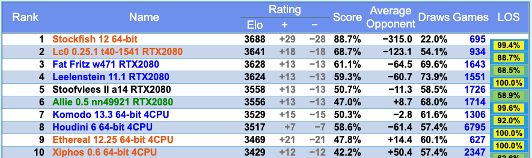

  

<h1 align="center">A Brief Introduction to Stockfish NNUE: (1) Background</h1>

<!--
[Stockfish](https://stockfishchess.org/ )是一款开源国际象棋程序。由于最初的开发者中的两位分别来自挪威和意大利，为了纪念两国历史悠久的鳕鱼贸易，开发者将他们的程序命名为了Stockfish。在过去的十多年中，一众爱好者对其不断维护完善，使其成为了棋力最为顶尖的国象程序之一。Stockfish将传统计算机国际象棋技术发挥到了极致，包括但不限于alpha-beta搜索，各种剪枝技术，以及手动调整参数的估值函数等等。至少在2017年之前，Stockfish几乎稳坐各大计算机国象程序棋力排名榜第一名。
-->
[Stockfish](https://stockfishchess.org/) is an open source chess engine program. Since two of the original developers were from Norway and Italy, the developers named their program Stockfish in honor of the historic stockfish trade between the two countries. In the past ten years, a group of enthusiasts have continuously maintained and improved this program, making it one of the most powerful chess programs. Stockfish has brought traditional computer chess techniques to the extreme, including alpha-beta search, various pruning techniques, and evaluation functions with manually tuned parameters, etc. At least before 2017, Stockfish was almost firmly in first place in the rankings of major computer chess programs.

<!--
然而2017年，Deep Mind发表了关于[Alpha Zero](https://kstatic.googleusercontent.com/files/2f51b2a749a284c2e2dfa13911da965f4855092a179469aedd15fbe4efe8f8cbf9c515ef83ac03a6515fa990e6f85fd827dcd477845e806f23a17845072dc7bd )的论文，并提出：以Monte-Calo Tree Search（MCTS）结合神经网络的方法照样可以达到甚至超越Stockfish现有的棋力。于是2018年，[Leela Chess Zero](https://lczero.org/ )（Lc0）横空出世。另一群爱好者依照Alpha Zero论文中的方法，经过近一年多的开发和参数训练，终于复现了Alpha Zero论文中的结果。截止到2019年底，在[CCRL](https://www.computerchess.org.uk/ccrl/) （Computer Chess Rating List）上，Lc0一度超越Stockfish，成为神经网络时代第一个依靠纯粹的强化学习的方法获得世界顶尖水平的国象程序。
-->
However, in 2017, Deep Mind published their [Alpha Zero](https://kstatic.googleusercontent.com/files/2f51b2a749a284c2e2dfa13911da965f4855092a179469aedd15fbe4efe8f8cbf9c515ef83ac03a6515fa990e6f85fd827dcd477845e806f23a17845072dc7bd), and proposed that the method of combining Monte-Calo Tree Search (MCTS) with neural networks which has reached or even surpassed Stockfish's existing chess power. In 2018, [Leela Chess Zero](https://lczero.org/) (Lc0) was released. Following the method in the Alpha Zero paper, another group of enthusiasts finally reproduced the results in the Alpha Zero paper after nearly a year of development and training. By the end of 2019, on the [CCRL](https://www.computerchess.org.uk/ccrl/) (Computer Chess Rating List), Lc0 had surpassed Stockfish and became the first ranking chess program in the neural network era to achieve the world's top level based on pure reinforcement learning methods.

<!--
至此，人们不禁会问，在计算机国象领域，是不是传统的基于alpha-beta搜索的方法可以被彻底抛弃了？深度强化学习的时代彻底碾压了一切传统方法？然而事实并不能那么简单的一刀切。Lc0的方法虽然达到了不错的结果，由于使用了无监督（或者说将环境反馈作为监督）策略，其训练的计算代价也是惊人的。有没有办法将利用传统方法中已有的技术来提升机器学习算法的效率？或者能否将传统搜索方法与神经网络相结合，各取所长？能否引入有监督学习以提升训练速度？
-->
At this moment, a question would naturally be raised by computer chess programers: can the traditional alpha-beta-based search method be completely abandoned in the field of computer science? Has deep reinforcement learning completely outperformed any traditional methods? The answer seems not that simple or straightforward. Although Lc0 has achieved good results, its approach has a price. Due to the application of unsupervised learning strategy (or using environment feedback as supervision), the computational cost of training is also staggering. Is there any way to improve the efficiency of learning algorithms by exploiting the existing techniques in traditional methods? Or is it possible to combine traditional search methods with deep neural networks so that both of their advantages can be taken? Can supervised learning be introduced to improve training speed?

<!--
一个显而易见的探索方向似乎是人们凭直觉就能想到的：基于alpha-beta搜索的程序需要调用估值函数对当前局面输出一个评估分值，即某一方获胜的概率。它的准确与否直接决定了对搜索的导向是否正确。既然神经网络的表示能力如此强大，为什么不把传统手写的估值函数换成一个神经网络模型，然后利用深度学习方法训练这个模型，来提高估值函数的准确性？
-->
There is an obvious direction of exploration that most people can realize simply by intuition: For the chess position, alpha-beta search needs to call the evaluation function to output an evaluation score, which is the probability of a side winning. The accuracy of the evaluation score will directly determine whether the guidance to the search is correct or not. Since the representation capability of the neural network is much powerful, why can't we replace the traditional manually implemented evaluation function with a neural network model, and then use deep learning methods to train this model to improve the accuracy of the evaluation function?

<!--
事实上，“将估值函数形式化为一个机器学习模型，并使用机器学习技术去训练它“这件事，很早就有人做了。例如，于上世纪五十年代就被提出的[Temporal Difference Learning](https://www.chessprogramming.org/Temporal_Difference_Learning )，以及1997年由Arthur Samuel，Don Beal和Martin Smith进一步改进的[TD-Leaf(lambda)](https://arxiv.org/pdf/cs/9901001.pdf)，被成功应用到KnightCap和CilkChess两个程序上。然而那个时候的人们并不知道引入非线性模型能够改进模型的表示能力，计算机有限的算力也不支持使用更大规模的训练数据。
-->
In fact, the idea of "formalizing the evaluation function into a machine learning model and using learning techniques to train it" has been considered years ago. For example, [Temporal Difference Learning](https://www.chessprogramming.org/Temporal_Difference_Learning) which was proposed in the 1950s , and [TD-Leaf(lambda)](https://arxiv.org/pdf/cs/9901001.pdf), which was further improved by Arthur Samuel, Don Beal and Martin Smith in 1997 , were successfully applied to KnightCap and CilkChess. However, people at that time did not know that introducing a nonlinear model could improve the representation ability of the model, and the limited computing power of the computer did not support the use of larger training data.

<!--
2015年，来自帝国理工学院的硕士生Matthew Lai改进了TD-Leaf(lambda)在国象中的训练方法，将原来的线性模型替换为一个简易的三层神经网络，并发布了实验性的国象程序[Giraffe](https://arxiv.org/pdf/1509.01549v1.pdf )。经过大概一周的训练，Giraffe从完全乱下棋水平，进步到了2400ELO（FIDE标准下的“象棋大师”候选人水平），算是非常巨大的进步。不得不说在PyTorch还没有发布的2015年，Matthew为了在训练中使用Torch，要先把网络本身以及一些训练需要用到的函数写成Lua程序，再用Torch自带的C++库将这些Lua程序封装并与自己国象程序的C++代码粘接在一起。可以说Giraffe能取得这样的成绩，Matthew付出的努力可谓“可歌可泣”。然而Giraffe只是在深度学习时代对这一方法的第一步探索，距离挑战世界一流的国象程序还是差的太远了。
-->
In 2015, Matthew Lai, a graduate student - who is also a chess programmer - from Imperial College London, improved the training method of TD-Leaf(lambda) in the chess, replaced the original linear model with a simple three-layer neural network, and released the experimental chess program [Giraffe](https://arxiv.org/pdf/1509.01549v1.pdf). After training for about a week, Giraffe has progressed from playing chess at random to 2400ELO (the level of a "chess master" candidate by FIDE), which is a huge improvement. 

It was 2015 when PyTorch was not yet released, to use Torch in training, Matthew first wrote the network itself and some functions needed for training into Lua programs, and then encapsulated these Lua programs with the C++ library that comes with Torch And glue it together with the C++ code of your own national elephant program.

It can be said that Giraffe can achieve such results, and the efforts made by Matthew can be described as "epic". However, Giraffe is only the first step to explore this method with deep learning, and it is still a long trip to the level of challenging the top-ranking chess programs.

<!--
至此人们发现，要想在alpha-beta搜索中使用神经网络估值函数，只少需要解决以下三个问题：

1. 如何在保证一定网络复杂性的同时能够快速的计算网络的向前传播？
2. 如果生成足够多样且泛化的训练数据，以及训练数据的标签应该从哪里来？
3. 应该用什么方法训练？

其中问题2、3是所有将现实世界问题形式化为机器学习问题时都会碰到的，而问题1却是这个探索方向所独有的。由于alpha-beta搜索所能达到的最大深度完全取决于单位时间内的搜索速度（即每秒搜索节点数），过慢的搜索速度势必会拉低程序的棋力，因为它会使得程序在单位时间内无法“看的更远”。然而大多数神经网络的向前传播都涉及多步的矩阵加法乘法运算。在CPU上运行这样一个未经优化的程序将会非常耗时。而这一问题是使用神经网络估值函数时所不可回避的。事实上，Giraffe使用神经网络估值时的搜索速度只有使用手写估值函数时的五分之一，这种显著的搜索速度的下降也是限制Giraffe棋力的因素之一。如何在保证网络复杂性的同时又不过多的拖慢搜索速度？这一棘手的取舍问题一直困扰着象棋程序设计者们。
-->
So far, people have found that: in order to successfully use the neural network evaluation function in alpha-beta search, the following three problems have to be solved:

1. How to efficiently compute the forward propagation of the network while ensuring some network complexity?
1. How to generate the training data with relatively enough diversity abd , and where should the labels of the training data come from?
1. What method should be used for training?

Among them, problems 2 and 3 are encountered when all real-world problems are formalized into machine learning problems, while problem 1 is unique to this direction of exploration. Since the maximum depth that alpha-beta search can reach depends entirely on the search speed per unit time (that is, the number of search nodes per second), too slow search speed will inevitably lower the program's chess power, because it will make the program in unit time It is impossible to "see further". However, the forward propagation of most neural networks involves multi-step matrix addition and multiplication operations. Running such an unoptimized program on a CPU would be very time consuming. And this problem is unavoidable when using the neural network evaluation function. In fact, Giraffe's search speed when using neural network evaluation is only one-fifth of that when using handwritten evaluation functions. This significant decrease in search speed is also one of the factors that limit Giraffe's chess power. How to ensure the complexity of the network without slowing down the search speed too much? This thorny trade-off has long plagued chess programmers.

<!--
到了2020年5月，事情有了转机。在国象论坛Talkchess出现了一篇关于[Stockfish-NNUE](https://www.chessprogramming.org/Stockfish_NNUE )的帖子，一位ID为[Nodchip](https://www.chessprogramming.org/Hisayori_Noda )的老兄第一次将NNUE技术引入了国象。7月底，Stockfish-NNUE的源码在了[Github](https://github.com/joergoster/Stockfish-NNUE )上正式公布。经过测试与改进，Stockfish-NNUE已经达到甚至超越了使用传统估值函数的Stockfish，并与2020年9月初正式并入Stockfish主分支，成为Stockfish 12的一部分。

NNUE的全名是[Efficiently Updatable Neural Network](https://github.com/ynasu87/nnue/blob/master/docs/nnue.pdf )（可快速更新神经网络），最初由日本将棋程序员[那須悠](https://github.com/ynasu87/nnue/blob/master/docs/nnue.pdf )于2018年提出，并应用于将棋程序中，Nodchip也是这个将棋程序小组中的一员。具体来说，Stockfish-NNUE做出了以下几个贡献：
-->
In May 2020, things took a turn for the better. A post about [Stockfish-NNUE](https://www.chessprogramming.org/Stockfish_NNUE) showed up in the chess programming forum Talkchess. A poster with the ID [Nodchip](https://www.chessprogramming.org/Hisayori_Noda) introduced NNUE technology into chess for the first time. At the end of July, the source code of Stockfish-NNUE was officially released on [Github](https://github.com/joergoster/Stockfish-NNUE). After testing and improvement, Stockfish-NNUE has reached or even surpassed Stockfish using traditional evaluation functions, and was officially merged into the main branch of Stockfish at the beginning of September 2020, becoming a part of Stockfish 12.

The full name of NNUE is [Efficiently Updatable Neural Network](https://github.com/ynasu87/nnue/blob/master/docs/nnue.pdf). It was originally proposed by Japanese shogi programmer [Nasu Yu](https://github.com/ynasu87/nnue/blob/master/docs/nnue.pdf) in 2018 and applied to shogi programs. Nodchip is also a member of this shogi program development team. Specifically, Stockfish-NNUE has made the following contributions:

<!--
1. 设计了一种二进制且高维度的棋盘表示，并且在对局或搜索进行时只做增量的更新。不同于之前的神经网络象棋程序，NNUE棋盘表示非常简单，即王所在格子与其他棋子的所在格子的组合。正是由于这一特点使得NNUE的棋盘表示可以增量更新，因为每走一步棋所能影响的棋子或格子都是有限的；
2. 使用了一个浅层（4层）的神经网络作为估值函数模型。网络的所有参数均为整型，并使用英特尔CPU中的高级指令优化矩阵加法和乘法的运算效率；
3. 提出了一种有监督学习的估值函数训练方法，并将两种目标值。一般来说，使用有监督学习训练估值函数，训练数据的目标值一般来自搜索算法使用手写估值函数搜索一定深度后所返回的值。NNUE的训练数据自然也采用了这种目标值，然而除此之外，NNUE还利用了自对弈棋局的最终结果（-1，0，+1对应输、平、赢）作为第二目标值，最后将两种目标加权平均后作为最终目标。加权的权重由参数lambda控制。
4. 设计了一个并行化的数据生成算法，使用原版Stockfish自动且高效的生成训练数据。

毫无疑问，Stockfish-NNUE是继Giraffe之后对“alpha-beta搜索+神经网络估值”这一方法最成功的一次尝试。在上文提到的三个问题中，Stockfish-NNUE都给出了相对不错的答案。这使得使用alpha-beta搜索的程序设计者们又有了一丝新的希望，尤其是在Lc0稳坐第一名近一年之时，NNUE技术的应用使Stockfish再次成为了Lc0“第一名”的挑战者之一。之后我会分几次更具体介绍一下NNUE在Stockfish中的应用。
-->

1. Designed a high-dimensional binary board representation, so that only incremental updates are made during the game or search to get the up-to-date representation vector. Unlike previous neural network chess programs, the NNUE board representation is very simple, that is, the combination of the square where the king is located and the squares where other chess pieces are located. It is precisely because of this feature that the chessboard representation of NNUE can be updated incrementally, because the pieces or grids that can be affected by each move are limited;
2. A shallow (4-layer) neural network is used as the evaluation function model. All parameters of the network are integers, and use advanced instructions in Intel CPU to optimize the operational efficiency of matrix addition and multiplication;
3. A supervised learning evaluation function training method is proposed, and two kinds of target values ​​are used. Generally speaking, supervised learning is used to train the evaluation function, and the target value of the training data generally comes from the value returned by the search algorithm after searching a certain depth using the handwritten evaluation function. NNUE's training data naturally also uses this target value, but in addition, NNUE also uses the final result of the self-play chess game (-1, 0, +1 corresponds to loss, draw, win) as the second target value, Finally, the weighted average of the two goals is taken as the final goal. The weighted weight is controlled by the parameter lambda.
4. A parallel data generation algorithm is given, using the original Stockfish to automatically and efficiently generate training data.

It is no doubt that Stockfish-NNUE is by-far the most successful attempt at the method of "alpha-beta search + neural network evaluation" after Giraffe. In the three questions mentioned above, Stockfish-NNUE provided an acceptable answer to each of them. This gives programmers who applied alpha-beta search in their chess program a new direction to pursue. The application of NNUE technology makes Stockfish become a challenger to Lc0 with strong potential, especially when Lc0 has been in the first place for nearly a year.
<!-- After that, I will introduce the application of NNUE in Stockfish in more detail several times. -->

|  |
| :---: |
| <em>CCRL Blitz Rating List Top 10 (by September 12, 2020)</em> |

### References

* [https://github.com/ynasu87/nnue/blob/master/docs/nnue.pdf](https://github.com/ynasu87/nnue/blob/master/docs/nnue.pdf)
* [NNUE - Chessprogramming wiki](https://www.chessprogramming.org/NNUE)
* [Stockfish NNUE - Chessprogramming wiki](https://www.chessprogramming.org/Stockfish_NNUE)
