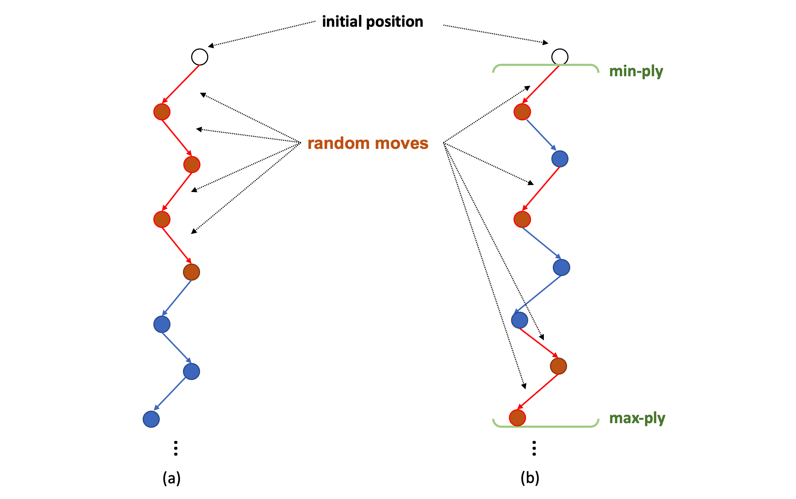
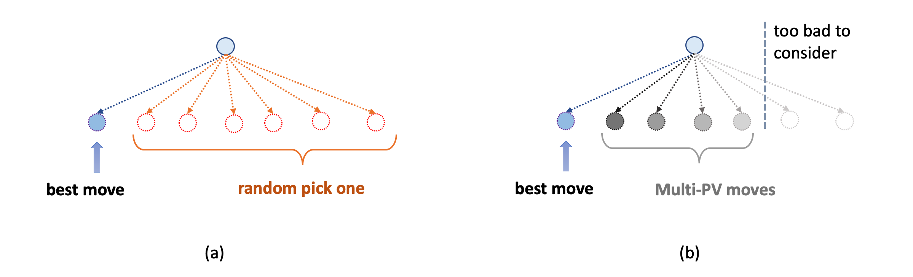
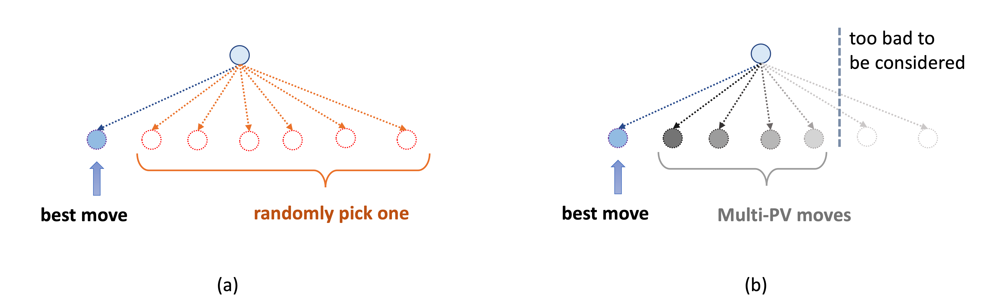
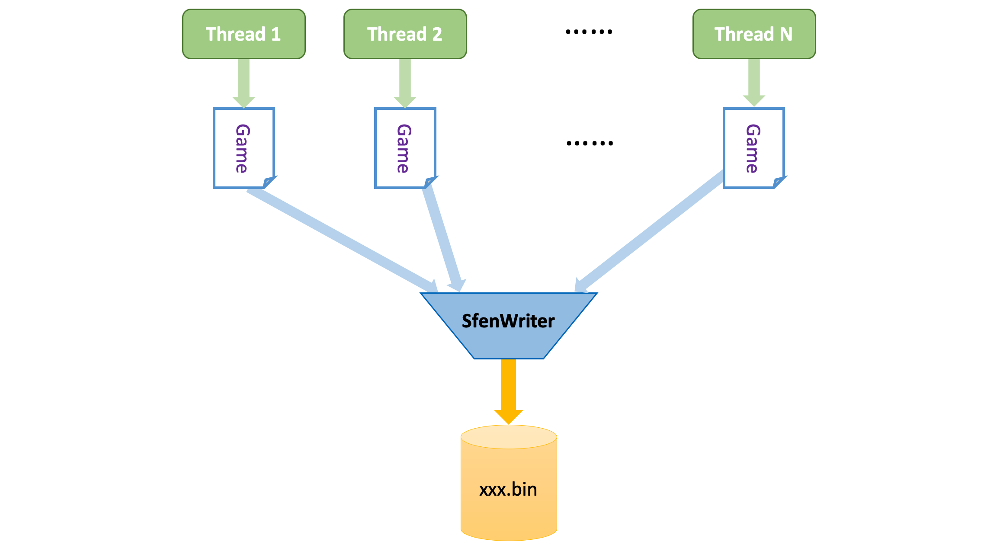

<p align="center">
  
</p>

<!-- <h1 align="center">国际象棋程序Stockfish NNUE设计简介（四）训练数据生成</h1> -->
<h1 align="center">A Brief Introduction to Stockfish NNUE: (4) Training Data Generation</h1>


<!--
前三篇主要介绍了在给定一个训练好的权重的前提下，Stockfish NNUE是如何使用它的。接下来的两篇我们会着重介绍一下如何训练一个NNUE网络的权重。

训练一个NNUE网络权重一般要经过两步：一，生成训练数据；二使用训练数据训练网络。如果你曾经编译过Stockfish NNUE，或者尝试训练NNUE权重的话，你就会知道，Stockfish NNUE从训练到实际应用，包含了三个可执行文件，分别对应三种不同的功能：

* **nnue**：使用了NNUE网络的Stockfish，用图形界面加载他就可以下棋了。
* **nnue-gen-sfen**：NNUE训练数据生成器。
* **nnue-learn**：NNUE网络权重训练器。

这其中，第二个可执行文件就是用来生成训练数据文件的（末尾我会简要介绍如何从源码编译得到这几个可执行文件）。本篇就着重介绍一下NNUE训练数据的生成方法。
-->
The first three articles mainly described how Stockfish uses a trained weight. In the next two articles, we will focus on how to train weights for a NNUE network.

Training a NNUE network weight generally requires two steps: first, generate training data; second, use the training data to train the network. If you have ever compiled Stockfish NNUE, or tried to train NNUE weights, you will realized that Stockfish NNUE actually includes three executable files that correspond to three different functions:

* **nnue**: Stockfish with the NNUE evaluation, you can play with it with a graphical interface.
* **nnue-gen-sfen**: NNUE training data generator.
* **nnue-learn**: NNUE network weights trainer.

Among them, the second executable file is used to generate training data files (at the end I will briefly introduce how to compile these executable files from source code). This article mainly focuses on the method of NNUE training data generation.

<!--
### PackedSfenValue结构体

NNUE的训练数据存储在一个二进制文件中。与所有有监督学习数据集类似，文件的内容就是一个巨大的训练样本序列。其中，每一个样本包含输入（已经提取特征了的feature vector或未经处理的原始数据）和标签。在NNUE的代码中，每个训练样本被称为PackedSfenValue。PackedSfenValue是一个40字节的结构体，包含了经过压缩的棋盘局面、胜负，搜索depth层返回的估值，搜索depth层返回的move，以及步数gamePly。每当我们跑一次NNUE的训练数据生成，就会生成这样一个xxx.bin的文件。由于此文件是由若干PackedSfenValue的字节块组成，因此它的大小一定是40字节的整数倍。例如，生成一个包含1000000样本（棋盘局面）的文件，其大小一定是40MB。

下面详细介绍一下PackedSfenValue结构体。PackedSfenValue包含了以下六个成员：

* **PackedSfen**：int8[32]，这是已经经过压缩的棋盘局面的[fen字符串](https://www.chessprogramming.org/Forsyth-Edwards_Notation)。fen是国象中常用的表示棋盘局面的字符串格式。然而原始fen字符串长度不定，且有很多允余信息。NNUE将其压缩为了32字节的紧凑格式。
* **score**：int16，从当前局面出发，使用Stockfish搜索depth层返回的估值。这里Stockfish执行alpha-beta搜索时使用的是Stockfish原版手写的估值函数（NNUE也提供了使用已训练好的NNUE网络来搜索的编译选项，但最后并没有使用）。一般来说，从当前局面经过depth层alpha-beta搜索时所返回的估值，要比直接调用估值函数评估当前局面的值相对来说更准确，且depth越大准确度越高。这是因为alpha-beta搜索对当前局面的动态分支都进行了探索，而手写的估值函数则往往只对局面的静态特征有较好的描述。（跑个题，这个获得score的过程其实正反映了我们对估值函数的期望：对当前局面的估值能够尽可能准确的反映搜索N层之后棋局的发展趋势，且N越大越好。可以想象一种极端完美的情况：估值函数的返回值与搜索到棋局结束之后的返回值相同——这个时候我们就不需要搜索了，直接用估值函数挑选最好的子节点返回就完事了。当然实际要做到这一点是几乎不可能的）
* **move**：uint16，上面提到的搜索返回score同时返回的对应的最佳着法。alpha-beta搜索不但能返回最佳子节点的值，还能顺便返回最佳子节点对应的着法，类似Dijkstra算法不但能返回最短路长度，还能返回最短路径本身。不过move并不参与训练，只用于评估。在训练过程中，每隔几个epoch，训练算法就会在校验集上应用刚训练好的NNUE网络，通过alpha-beta搜索得到一个最佳着法，然后比对该着法与move是否一致，并计在最后计算在整校验集中一致的样本占整个校验集的百分比。在训练的早期，NNUE网络的权重还很不靠谱时，这个百分比能一定程度的反映训练的进度。
* **gamePly**：uint16，对局步数，也就是当前对局已经到了第几步。
* **game_result**：int8，对局结果，1表示“己方”最终获胜，-1表示“对方”最终获胜，0表示和起。“己方”的定义与第二篇介绍的一样，就是当前走棋的一方。
* **padding**：uint8，补充字节，目前未使用。

单从PackedSfenValue的内容，我们依旧能够看到一些NNUE训练数据的特点。其中最重要的一点就是，NNUE的训练样本中的每个棋盘局面都来自一个从国象初始局面开始的完整对局，因此才会包含gamePly和game_result这两项。尤其是game_result的加入，使得NNUE学习阶段的目标不单纯的依赖于score，而是一个score与game_result的线性组合，有点类似于短期目标和长期目标的结合。想象一下，如果NNUE的训练阶段完全依赖于score，而score又是Stockfish通过手写估值函数搜索得到的值，那么最终无非会出现两种情况：

1. 如果这个手写函数的估值不准确，那么NNUE的训练就会被它误导，结果恐怕不会太好；
1. 如果这个手写函数的估值非常准确，那NNUE的训练成果到底该归功于训练本身，还是这个手写函数提供的高质量数据？而且既然已经有了这么准确的手写估值函数，干嘛还要再训练一个NNUE网络呢？

显然，无论那种情况都会导致NNUE的训练结果严重依赖于手写估值函数的质量，这就产生了一个“先有鸡还是先有蛋”的问题。game_result的加入虽然未能彻底解决训练过程对手写估值函数的依赖，但一定程度的校正了手写估值函数自身缺陷对训练的负面影响[^1]。
-->

### PackedSfenValue structure

The training data for NNUE is stored in a binary file. 
Like a typical supervised learning datasets, the content of the file is simply a huge sequence of training examples. 
Among them, each example contains input (extracted feature vector or unprocessed raw data) and label. In NNUE's code, each training example is 40-byte data block named *PackedSfenValue*.
"PackedSfenValue" is just "PackedSfen" plus "Value".
`PackedSfen`, corresponds to the input part of each example, is a 32-byte structure that contains the compressed fen string of a position.
`Value`, corresponds to the label part of each example, is a 8-byte block includes `game result`(win/loss/draw), `score` and `best move` returned by an alpha-beta search for some depth, and the number of played moves `gamePly`. 
Whenever we run NNUE training data generation, such a `xxx.bin` file will be generated. 
Since this file consists of a number of PackedSfenValue byte blocks, its size must be an integer multiple of 40 bytes. For example, to generate a file containing 1000000 examples (positions), its size must be 40MB.

We first introduce the `PackedSfenValue` structure in details. `PackedSfenValue` contains the following fields:

* **PackedSfen**: int8[32], this is the compressed [fen string](https://www.chessprogramming.org/Forsyth-Edwards_Notation) of each input chess position. fen string is a commonly used human-readable board presentation format for chess.
However, the original fen string has a variable length and has a lot of residual information. NNUE compresses it into a compact format of 32 bytes.
* **score**: int16, the returned value obtained by Stockfish to search for `depth` layers starting from the current position.
Here, Stockfish uses the original handwritten evaluation function when performing alpha-beta search (NNUE also provides a compilation option to use the trained NNUE network to search, but it was not turned on by default).
Generally speaking, the evaluation returned from the current position through the `depth` layer alpha-beta search is relatively more accurate than the value of directly calling the function to evaluate the current position, and the greater the `depth`, the higher the accuracy. 
This is because the alpha-beta search explores all the dynamic branches of the current position, while the handwritten evaluation function usually is only good at catching the static characteristics of the position.
(BTW, the process of obtaining the score actually reflects our expectation to the evaluation function: the evaluation of the current position should reflect the  trend of the chess game after searching N layers as accurately as possible, and the larger N is, the better. 
You can imagine an extremely perfect case: the return value of the evaluation function is the same as the return value after searching towards the end of the game - in this case we don't even need to search, just use the evaluation function to select the best child node and return it, job done. 
Of course this is impossible in practice, but the more close the evaluation function could be to this perfect case, the more useful/accurate the evaluation function is)
* **move**: uint16, the search mentioned above returns the score and its corresponding best move. 
Alpha-beta search would return not only the value of the best child node, but also the corresponding move to reach that best child node (this is similar to the Dijkstra algorithm, which would not only return the length of the shortest path, but also return the shortest path itself).
However, `move` does not participate in training. It is only used for validation. 
During the training process, after some epochs, a validation will be run to evaluate the process of training: for each position in the validation set, Stockfish will assign the current newly trained NNUE network, obtain a best move through alpha-beta search, and then compare whether this searched move is consistent with the given move, and finally compute the percentage of consistent examples in the entire validation set.
In the early stage of training when the parameters of the NNUE network are still unstable, this percentage can reflect the progress of training.
* **gamePly**: uint16, the number of game steps, which is how many moves have been made in the current game.
* **game_result**: int8, the result of the game, 1 means "our side" wins, -1 means "our side" loses, and 0 means draw.
The definition of "our side" has been introduced in part (2) in this series of articles. 
Basically, "our side" is just the side to move in the current position.
* **padding**: uint8, padding bytes, currently not used.

From the label design of PackedSfenValue, we can see some characteristics of NNUE training data.
The key idea is: each position in NNUE's training example comes from a complete game starting from the initial chess position, so the two items `gamePly` and `game_result` can be included in “Value” part. 
Especially the additional `game_result` makes the target of the NNUE learning not simply depend on the `score`, but a linear combination of `score` and `game_result`, which is somewhat similar to the combination of short-term target and long-term target. 
Imagine that if the training phase of NNUE is completely dependent on `score`, and `score` is the value obtained by Stockfish through running an alpha-beta search with the handwritten evaluation function, then there will be two possible cases:

1. If the estimation of this handwritten function is inaccurate, then the training of NNUE will be misled by it, and the result may not be very good;
2. If the estimation of this handwritten function is very accurate, then the training result should be not bad, but which part contributes most to this good result?The training algorithm itself, or the high-quality data labeling provided by this handwritten function? And since we already have such an accurate handwritten evaluation function, why do we need to train another NNUE network?

Obviously, in either case, the training results of NNUE will heavily depend on the quality of the handwritten evaluation function, which leads to a "chicken or the egg" problem. 
Adding the `game_result` might not completely solve the dependency of the handwritten evaluation function in the training process, it provides an additional source of labeling in training to correct the negative impact of non-perfect `score` caused by the inaccuracy of  handwritten evaluation function.


<!--
### 生成算法

NNUE的训练数据生成是以自对弈为基本单位进行的。整个生成算法包含了两层循环。外循环是关于生成、存储棋局的，内循环则是每个自对弈棋局的每一步。以下是伪代码：
```
while (finished < loop) {
	// store last finished game
	storeGame(game, game_result);
	finished += ply;

	// initialize new game
	game = [];
	game_result = UNKNOWN;
	position = initialPosition;

	// start self-play
	for (ply = 0; ply < maxPly; ply++) {
		if (position.isGameOver()) { // game is over
			game_result = position.gameResult();
			break;
		}
		if (score >= eval_limit) { // score has exceeded eval_limit
			break;
		}
		if (position.legalMoveNumber() == 0){ // no legal moves available, draw
			break;
		}

		// run alpha-beta search for the best move and score
		score, move = search(position, depth, nodes);

		// temporarily store the new sample to game
		game[ply] = (position.PackedSfen(), score, move, ply);

		// execute self-play move
		position.makeMove(move);
	}
}
```
其中，search部分就是上文提到的固定层数的alpha-beta搜索。每次搜索之后就会得到score和move，加上无需搜索就有的PackedSfen和gamePly，就得到了一个PackedSfenValue结构体的大部分值，而game_result要等每个对局结束之后才加入。简单来说，生成数据的过程其实就是使用原版（不用NNUE的版本）Stockfish不停的跑自对弈的过程。

至此，我们可以简要对比NNUE与Giraffe在生成训练数据方法上的区别。Giraffe的训练数据有几点重要的不同：

1. Giraffe的训练数据是线上生成的。也就是说，Giraffe不存在专门的生成训练数据文件这一步，而是每个mini-batch的权重更新之前，现场生成训练数据并存与内存中。而NNUE使用的线下生成数据：训练开始的时候，直接从磁盘成块的读取训练数据就行了。
1. Giraffe样本中的label要简单的多，只有一个棋盘表示和搜索之后的PV line和PV上每个着法对应的score。而NNUE的label则包含了除局面信息之外的四项内容。
1. 也是由于（2）的原因，Giraffe的局面虽然也是来源于自对弈，但是它的起始局面并不是从国象的起始局面开始的，而是从一个巨大的真实对局库中随机sample出来一个局面，并在这个局面的基础上先随机走一步，然后再才开始自对弈的。从这里我们也可以看到，由于训练算法的不同，Giraffe并不在乎自对弈的最终结果，而更在乎自对弈的着法序列本身，毕竟那才是是TD-Leaf(lambda)的输入。
-->

### Generating algorithm

The training data generation of NNUE is based on the self-play game as the basic unit. The whole generation algorithm contains two nested loops. The outer loop is about generating and storing the game, and the inner loop is about searching and making each move in each self-playing game. The following is pseudocode:
```
while (finished < loop) {
 // store last finished game
 storeGame(game, game_result);
 finished += ply;

 // initialize new game
 game = [];
 game_result = UNKNOWN;
 position = initialPosition;

 // start self-play
 for (ply = 0; ply < maxPly; ply++) {
   if (position.isGameOver()) { // game is over
     game_result = position.gameResult();
     break;
   }
   if (score >= eval_limit) { // score has exceeded eval_limit
     break;
   }
   if (position.legalMoveNumber() == 0){ // no legal moves available, draw
     break;
   }

   // run alpha-beta search for the best move and score
   score, move = search(position, depth, nodes);

   // temporarily store the new sample to game
   game[ply] = (position.PackedSfen(), score, move, ply);

   // execute self-play move
   position.makeMove(move);
 }
}
```
In this pseudocode, the search is the alpha-beta search with a fixed depth mentioned above.
After running a search, you will get `score` and `move` (best move) from returning values of search function. Together with PackedSfen (compressed current position) and `gamePly` which are available without searching, you will get most of the values ​​of a PackedSfenValue structure.
The only missing one is `game_result`. It will be added to each PackedSfenValue in this game once the game is complete and the winner is known.
In fact, the process of generating data is actually the process of using the original version (the version without NNUE evaluation) Stockfish to run self-playings.

Now, we can briefly compare the difference of training data generation methods between NNUE and Giraffe. Giraffe method is different in three major aspects:

1. The training data of Giraffe is generated online. That is to say, Giraffe does not have a special step of generating training data files. 
Instead, before the weight update of each mini-batch, that mini-batch of training data is generated online and stored in memory. 
On the contrary, NNUE uses offline data generation: when the training starts, training data has been generated and remains unchanged. Trainer just reads the data directly from the disk and performs optimization.
2. The label in each Giraffe training example is different. 
Each Giraffe example contains a board representation vector, a score returned by search and the ply of current position in the game. NNUE examples also record this information. And besides, a `best_move` (for evaluation purpose) and a `game_result` (as potential training label) are also included.
3. Also because of (2), although Giraffe training positions are also derived from self-play, its starting position is not the standard initial chess position.
Giraffe picks the starting position with the following approach: first, randomly sampled a position from a huge real game database (from CCRL historical games); second, take a random move on this sampled position to get a new position, then start self-playing from here (for 12 moves, see section 4.5 of this paper). Giraffe uses this approach to avoid repetitive games.
Differently, NNUE alway starts from standard initial position, but prevents repetitive games by applying opening books and playing random moves during each game.
From here we can see that, due to the different training algorithms, Giraffe does not care about the final result of the self-play game, but cares more about the sequence of moves of the self-play game itself, which is exactly the input of TD-Leaf (lambda).
While NNUE tries to keep each game playing as complete as possible since `game_result` is part of the training label.


<!--
以下简单介绍一下生成算法用到一些参数。你可以在用命令行启动可执行文件时设置这些参数。

首先是一些系统参数：

* **thread_num**, int：总共要用到的线程数。NNUE的生成程序支持并行化，因此可用的线程越多速度越快。注意这个参数是Stockfish自带的UCI选项，而不是NNUE的命令行参数。设置该参数的方法，与设置Stockfish采用多少个线程做并行化搜索时的方法一致，需要使用UCI协议中的option命令。关于什么是[UCI协议，可参考这里](https://www.chessprogramming.org/UCI)。
* **output_file_name**, string：输出文件名。默认文件名是“generated_kifu.bin”。
* **random_file_name**, bool：是否使用随机文件名。设为true生成程序会在文件名后面追加一个128位的随机整数，这样就不用担心每次运行时把已有的老的生成文件给覆盖掉。默认为false。
* **save_every**, int：是否将生成数据按每x个输出为一个不同的文件，该参数值即为x。例如，总共输出10000样本，save_every = 1000，那么最终会得到10个文件，每个文件1000样本。默认为64位整数的最大值，也就相当于“无穷大”，等于默认只生成一个文件。

以下是关于生成算法本身的一些参数：

* **loop**, int：总共要生成的样本个数，或者棋盘局面个数。注意此参数并不是指对局个数。例如，我们设置loop = 10000，他可以由100局对局组成，其中每个对局100步，也可以是500个对局，其中每个对局20步。总之最后的局面个数总和要等于10000。
* **eval_limit**, int：对局继续进行下去的估值上限。我们知道估值实际是反映的双方的形势分数的差距。有些时候，如果双方差距太大，那么继续进行下去就没有必要了。默认值 = 3000，相当于大概三个后的价值——如果某一方比另一方多出了三个后的优势，那该局继续下去的意义确实不大了。
* **write_minply**, int：输出局面的最早步数，早于该步的局面不会被包含到生成数据中。出于对生成的局面多样性的控制，NNUE尝试避免收录过于初始和过于接近终局的局面。过早的局面因为刚刚从初始局面没走几步，不同对局之间可能会存在大量的重复，以至于最终主导整个训练集，导致训练过多的拟合开局局面。而过深的终局由于非常少见，可能会引起不必要的过拟合。默认值 = 16。
* **write_maxply**, int：输出局面的最晚步数，晚于该步的局面不会被包含到生成数据中。默认值 = 400。

最后是关于生成过程中的alpha-beta搜索部分的参数：

* **use_eval_hash**, bool：搜索是否使用Evaluation Table（关于什么是[Evaluation Table可参考这里](https://www.chessprogramming.org/Evaluation_Hash_Table)）。简单来说它只是一个加速搜索的方法：在内存中缓存一些已经计算过的局面的估值，这样同样的局面再次出现时就不用重算了。
* **depth**, int：为了得到score而搜索的层数。默认值 = 3，但是3太小了，正式生成数据时一定会被设置为8以上。
* **depth2**, int：为了得到score而搜索的层数最大上限，一般大于depth。为了增加生成数据的多样性，NNUE允许不只搜索一个固定的层数，而是在depth和depth2随机选取一个深度，然后运行搜索。默认值与depth相同（此时该随机机制并未起作用）。
* **nodes**, int：搜索节点数上限。搜索的停止条件除了时间用尽和最大深度已达到之外，还可以控制搜索的最大节点数。如果搜索的节点数达到或超过了该上限，则立即停止搜索并返回结果。默认值 = 0，即不使用该停止条件。
-->

In the following section, we will briefly introduce the parameters used in the generation algorithm. You can set these parameters as arguments when running the executable binary from the command line.

First are some system parameters:

* **thread_num**, int: the total number of threads to use. The data generator supports parallelization. The more threads available, the faster it will be. Note that this parameter is a UCI option that comes with Stockfish, not a command line parameter of NNUE.
Setting this parameter is the same as the method of setting the number of threads used by Stockfish for parallel search, and the option command in the UCI protocol needs to be used. About what is [the UCI protocol, see here for more  details](https://www.chessprogramming.org/UCI).
* **output_file_name**, string: output file name. The default file name is "generated_kifu.bin".
* **random_file_name**, bool: whether to use a random filename. If set to true, the generator will append a 128-bit random integer to the file name, so that you don't have to worry about overwriting the existing old generated files each time when you re-run it. The default value is false.
* **save_every**, int: whether to output the generated data as a different file after every x positions. For example, output a total of 10000 samples, save_every = 1000, then you will end up with 10 files, each with 1000 samples. The default is the maximum value of a 64-bit integer, which is equivalent to "infinity". therefore only one file would be generated by default (since this default threshold for the second file will never be reached in practice).


Following are the parameters about the generation algorithm itself:

* **loop**, int: the total number of examples (chess positions) to be generated. Note that this parameter is NOT the number of games. For example, if we set loop = 10000, it can consist of 100 games with 100 moves each, or 500 games with 20 moves each, either case is possible. In short, the sum of the final number of positions must be equal to 10000.
* **eval_limit**, int: the upper bound of the evaluation for the game to continue. We know that the absolute value of an evaluation score reflects the advantage of one side over the other.
Sometimes, if the advantage gap between the two sides is too large, it is probably not necessary to continue the game. 
Default value = 3000,  which equals to the piece value of about three queens - if one side has three queens more than the other, it really doesn't make much sense to continue the game, since the former must win.
* **write_minply**, int: the earliest step to output positions in a game, the position earlier than this step will not be included in the generated data. 
In order to control the diversity of generated positions, NNUE tries to avoid including the positions that are too close to the initial or ending position.
The problem of positions that are too close to the initial position is that: 
only a few moves were made from the initial position, thus the changes are limited and they may contain a lot of repetitions between different games.
Those repeated positions will eventually dominate the entire training set, resulting in too much training to fit the opening positions. 
And including positions that are too close to the ending positions may cause unnecessary overfitting. Because some of those deep ending game branches are very game specific therefore very uncommon to see in other games. We do not want to perform too much training on those corner cases. Default = 16.
* **write_maxply**, int: the latest step to output positions in a game, the position later than this step will not be included in the generated data. Default = 400.


Finally, the parameters for the alpha-beta search in the self-play:

* **use_eval_hash**, bool: whether to use Evaluation Table in search or not ([See here about what is Evaluation Table](https://www.chessprogramming.org/Evaluation_Hash_Table)).
Evaluation Table is for speeding up the search: cache the evaluation score of the positions in memory that has been computed before, so that we do not need to re-compute the evaluation score when the same position shows up again during search.
* **depth**, int: the depth to search for score. The default value = 3, but 3 is too small, usually a depth of 8 or more would be set in the actual data generation.
* **depth2**, int: the upper bound of the depth to search for score, generally greater than depth. 
In order to increase the diversity of generated data, NNUE allows not only to search with a fixed depth, but a random depth sampled within range [`depth`, `depth2`], and then run the search. 
The default value is the same as depth (therefore the depth sampling mechanism is not applied by default).
* **nodes**, int: the maximum number of nodes to be searched. 
There are a variety of stopping conditions of alpha-beta search, for example, time limit, maximum depth limit, or maximum number of nodes limit.
If the number of nodes searched reaches or exceeds the upper limit, the search is stopped immediately and the results are returned. Default = 0, which means that this stopping condition is not used by default.


<!--
### 加入了随机着法的自对弈

上文提到的对局生成阶段，如果完全依赖于自对弈，并且每次都从初始局面开始的话，那么首先要解决“对局重复”的问题。

alpha-beta搜索是存在不确定性的，即给定完全一致的输入，其搜索结果也可能会不同。这些不确定性主要来自以下三个方面：

1. 由于alpha-beta搜索会配合迭代加深使用，而迭代加深搜索的停止条件是往往是时间用尽。因此每次搜索的停止点会因为计时器的细微差别而不同，进而可能会导致不同的搜索结果。
1. alpha-beta搜索需要调用启发算法对某个局面的所有着法预先排序。某些着法的启发分数可能是相等的，这就导致了排序的不稳定性问题。
1. 为了快搜索，国象程序往往会使用[Tranposition Table](https://www.chessprogramming.org/Transposition_Table)，类似于一个哈希表。其中每个局面的key是通过一些64位随机整数计算而来，这些整数被称为[Zobrist key](https://www.chessprogramming.org/Zobrist_Hashing)。大多数程序会在开始运行时随机的生成这Zobrist key。如果两次运行之间的Zobrist key不一致，也可能导致不同的搜索结果。

其中（3）只有在两次搜索之间重新初始化程序才可能发生，显然不符合NNUE生成算法的实际情况。（2）发生的概率极小，只有（1）最为常见。然而，NNUE生成算法中的搜索是以层数depth作为停止条件的，于是时间这个不确定因素就不存在了。如此一来就有极高的概率，每一步搜索得到的最佳着法也是不会变化的，那么跑一个对局跟跑一百万对局没有任何区别——一百万个对局长的全一样。为了解决这个问题，NNUE人为的在每个对局中加入了N步的“随机着法”，也就是在某步执行一个最佳着法之外的走法（“最佳着法”就是搜索得到的着法），从而增加对局的多样性。关于如何添加"随机着法"的问题，可以分解为“纵向”和“横向”两个子问题。

首先是“纵向问题”，即给定N个随机着法配额的前提下，在对局中的哪几步添加随机着法？NNUE提供了两种策略：

#### **添加位置策略一：Continuous Moves from Initial Position**

这种策略最为简单，即从初始局面开始，双方连着走总共N步随机走法，然后再正式开始没有随机走法的自对弈。相当于双方随机生成了一个开局，再沿着次开局正常对弈下去。

#### **添加位置策略二：Discontinuous Moves Given Min-ply and Max-ply**

该策略不要求随机走法是连续的，而是可以出现在一个设定范围内的的任何位置。所谓min-ply和max-ply就是允许出现随机着法的最早步数和最晚步数。例如min-ply = 1，max-ply = 24表示在第1到第24步之间任选N步执行随机着法。

以下是控制NNUE使用哪种策略的相关参数：

* **random_move_count**, int：就是上文提到的“N个随机着法”中的N，默认值 = 5。
* **random_move_minply**, int：策略二中的min-ply，默认值 = 1（注意这里的步数是从0开始的，所以1其实是第二步）。如果random_move_minply被设置为-1，那么就意味着NNUE选择了策略一。
* **random_move_maxply**, int：策略二中的max-ply，默认值 = 24。如果选择了策略一，该参数将被忽略。


|  |
| :---: |
| <em>添加位置策略示意图：(a) 策略一（b）策略二。箭头线代表随机着法，圆圈代表执行着法后的棋盘局面。红色为随机着法，蓝色为最佳着法。此图中random_move_count = 4</em> |
-->

### Self-play Game with Random Moves

If the game generation phase mentioned above relies entirely on self-play and starts from the initial situation every time, then the problem of "game repetition" must be solved first.

Alpha-beta search has uncertainty: taken the completely same inputs, search results may also be different. These uncertainties mainly come from the following three aspects:

1. Since the alpha-beta search will be used in conjunction with iterative deepening, the stop condition for iterative deepening is usually time-limit-exceed. So the stopping point of each search will be different due to the slight difference of the timer, which may lead to different search results.
2. Alpha-beta search needs to call the heuristic function to sort all legal moves of a given position. When the heuristic scores are equal for some moves, they may have the instability issue on their ranking (See “[sorting algorithm stability](https://stackoverflow.com/questions/1517793/what-is-stability-in-sorting-algorithms-and-why-is-it-important)”).
3. In order to search efficiently, chess programs use [Transposition Table](https://www.chessprogramming.org/Transposition_Table), which is similar to a hash table that stores existing search results for traversed positions. The key of each position is computed by a set of 64-bit random integers, which are called [Zobrist keys](https://www.chessprogramming.org/Zobrist_Hashing). Most programs will generate these random Zobrist keys when they start running. It can also lead to different search results if the Zobrist key is inconsistent between runs.

Among them, (3) can only happen if the program is reinitialized between two searches, which obviously does not fit the actual case of the NNUE generation algorithm. The probability of occurrence of (2) is extremely small, and only (1) is the most common cause. However, the search in the NNUE generation algorithm uses the depth-limit as the stop condition, so the uncertainty caused by time would not exist. 

With all analysis above, we can conclude that: for a given position, it is highly possible that 
the best move obtained by the search will not change among different games. So there is no difference between running one game and running a million games - those one million games would be all the same.
In order to solve this problem, NNUE manually added `N` steps of "random moves" in each game, that is, to execute a move other than the best move at some step ("best move" is the move obtained by search), thereby increasing the diversity of the game. 
The problem of “how to add random moves” can be decomposed into two sub-problems of "vertical" and "horizontal".
The first is the "vertical problem": given the quota of N random moves, which steps in the game are random moves added? NNUE generator provides two strategies:

#### **Adding Step Selection Strategy 1: Continuous Moves from Initial Position**

This strategy is the simplest, that is, starting from the initial situation, the two sides make a total of N steps of random moves, and then formally start the self-play game without random moves. It is equivalent to the two sides randomly generating an opening, and then proceeding to play the game normally along this opening.

#### **Adding Step Selection Strategy 2: Discontinuous Moves Given Min-ply and Max-ply**

This strategy does not require random moves to be continuous. Instead, random move can appear anywhere within a range. The so-called `min-ply` and `max-ply` are the earliest and latest steps that allow random moves. For example, `min-ply` = 1, `max-ply` = 24 means to choose `N` steps between the 1st and 24th steps to perform random moves.

Here are the relevant parameters that controls these strategies:

* **random_move_count**, int: it is the `N` in the "N random moves" mentioned above, the default value = 5.
* **random_move_minply**, int: `min-ply` in strategy two, default value = 1 (note that the index of steps here starts from 0, so 1 is actually the second step). If  random_move_minply is set to -1, it means that NNUE has chosen strategy one.
* **random_move_maxply**, int: `max-ply` in strategy two, default = 24. If strategy one is selected, this parameter will be ignored.

|  |
| :---: |
| <em>Diagram of adding location strategy: (a) strategy one (b) strategy two. Arrowed lines represent random moves, and circles represent the position after executing the moves. The red arrows are random moves, and blue ones are the best moves. In this diagram, `random_move_count` = 4.</em> |


<!--
其次是“横向问题”，即假定某一步我们决定走“随机着法”，应该在所有合法着法中选择哪一个着法作为“随机着法”呢？对此，NNUE也同样提供了三类策略：

#### **随机着法选择策略一：Pure Random Move like Apery**

这种策略最为简单暴力，直接在所有除最佳着法之外的走法中随机选一个。“Apery”的本意是“模仿”，而且是比较拙略的模仿。我猜作者就是用它形容这种纯无脑随机的策略吧。

#### **随机着法选择策略二：Pure Random Move unlike Apery**

与策略一类似，唯一的不同是是，当合法着法当中有移动王的走法时，则只在这些“王的走法”当中随机选择。其他情况则与策略一一致。我个人并不太清楚这种对王的着法的特殊照顾目的何在。

#### **随机着法选择策略三：Random Multi-PV Move**

Multi-PV其实是alpha-beta搜索的一个附带功能。PV是Principal Variation的缩写（中文一般译作“主要变例”，然而这个翻译感觉更让人费解），其实就是alpha-beta搜索得到的最佳着法序列，也就是alpha-beta搜索认为的，接下来的若干步所应该走的着法。一般对一个局面，搜索只返回最佳着法和对应PV就足够了。但是有些情况下，我们希望搜索能够返回不止一个最佳着法——比如我们在分析某个局面时，希望能够返回前三个最佳着法，按照最好到最差排序，这就是应用Multi-PV的地方（关于[PV](https://www.chessprogramming.org/Principal_Variation)和[Multi-PV](https://talkchess.com/forum3/viewtopic.php?t=70126)的介绍请看这里）。

Multi-PV中所谓“最好”、“次好”、“第三好”无非就是将每个着法都进行全窗口的alpha-beta搜索以得到着法的分数，再按照分数从大到小排序，然后取top-k得来的。除此之外，NNUE还使用了一个margin去做筛选：任何与最佳着法的分数差距大于margin的着法便不再考虑。例如，最佳着法100分，margin=30，那么所有小于70分的着法就不考虑了。这样就排除了候选着法小于k时而不得不囊括进一些过于烂的着法的可能性。

可以看到，前两个策略都是在所有合法着法中像掷骰子一样纯随机的做选择，而完全不去考虑这个着法的质量。这种做法虽然大大增加了对局的多样性，然而也有机率引入了一些蠢到离谱的着法，以至于理性的对局中几乎不会出现。这不但可能使后续训练浪费资源在这些并不常见的局面中，而且使得game_result的可信度下降。相反，当前这个策略则将着法的质量考虑了进去：“我们会随机选择一个着法，但仍旧是在最好的前几名中随机选择一个“，这比在所有着法中胡乱选一个要靠谱的多。然而代价是生成对局的多样性受到了限制，毕竟Multi-PV的着法只是所有合法着法中的一小部分，且返回Mult-PV的搜索需要额外的时间开销。

以下是控制NNUE随机着法选择策略的相关参数：

* **random_multi_pv**, int：Multi-PV的个数，也就是搜索希望考虑的top-k最佳着法中的k。注意这里的top-k只是第一步，接下来还要根据每个着法与最佳着法的分数差去掉差距太大的。如果该参数为0，那么将采用策略一或策略二；只有该参数大于0时采取策略三。
* **random_multi_pv_diff**, int：备选的Multi-PV着法与最佳着法的最大分数差，也就是上文提到的margin。
* **random_multi_pv_depth**, int：用于Multi-PV搜索的深度。该深度可以与标准搜索的深度depth不同，因为同样深度的Multi-PV搜索更加耗时，因此适当减小深度加快速度也是可能的。
* **random_move_like_apery**, int：是否使用Apery方法，用于区分策略一与策略二。当该参数取0时使用策略二，否则使用策略一。该参数仅在random_multi_pv = 0时有效。


|  |
| :---: |
| <em>随机着法选取策略示意图：（a）策略一、二（b）策略三。虚线箭头线代表备选着法，圆圈代表执行着法后的棋盘局面。Multi-PV部分，灰色越深的着法分数越高，和最佳着法分数差越小</em> |
-->

The second is the "horizontal problem", that is, assuming that we decide to take a "random move" at a certain step, which move should we choose as a "random move" among all legal moves? In this aspect, NNUE also provides three types of strategies:

#### **Random Move Selection Strategy 1: Pure Random Move like Apery**

This strategy is the simplest and most brute-force: directly selecting one from all moves other than the best one at random. The original meaning of "Apery" is "to imitate", and it is a relatively crude imitation. I guess the author uses it to describe this purely brainless random strategy?

#### **Random Move Selection Strategy 2: Pure Random Move unlike Apery**

Similar to strategy 1, the only difference is that when there is a king move among all legal moves, it will only randomly select among the king moves. Otherwise, follow strategy 1.
(I personally do not fully understand the purpose for specially taking care of the king moves, probably to avoid some stupid random moves when the king is under check or in danger)

#### **Random Move Selection Strategy 3: Random Multi-PV Move**

Multi-PV is actually an incidental function of alpha-beta search. “PV” is the abbreviation of “Principal Variation”. It is the best move sequence obtained by the alpha-beta search, which is also what alpha-beta search believes that the moves should be taken for the next few steps. 
Usually for a position, it is enough for the search to return only the best move and the corresponding PV. But in some cases, we want the search to return more than one best move. For example, when we analyze a given position, we hope to return the top three best moves, sorted from best to worst, this is the right moment of applying Multi-PV technology.
(see here for the introduction of [PV](https://www.chessprogramming.org/Principal_Variation) and [Multi-PV](https://talkchess.com/forum3/viewtopic.php?t=70126)).

The so-called "best", "second best", and "third best" in Multi-PV are nothing more than conducting a full-window alpha-beta search for each move to obtain the score of the move, and then sort the moves by their score in the descent ordering, and then take the top-k. In addition, NNUE also uses a margin to do some filtering: any move with a score difference greater than the margin from the best move will not be considered. For example, if the best move is 100 score, margin=30, then all moves with less than 70 score will not be considered. This eliminates the case of having to include some too-bad moves even though their rankings are higher than `k`th.

We can see that the first two strategies make purely random choices among all legal moves like rolling dice, without considering the quality of these moves at all. Although this approach greatly increases the diversity of the game, it also has a chance to introduce some outrageously stupid moves that would hardly appear in rational or real games. 
This would not only mislead the training on those uncommon moves and positions, but also reduces the credibility of `game_result`. 
In contrast, the current strategy takes the quality of the move into account: "we'll pick a move at random, but still randomly pick one of the best top few moves", which is better and more reliable than randomly picking a move out of all the moves. However, the price is that the diversity of generated games is limited. After all, Multi-PV moves are only a small proportion of all legal moves, and the search for returning Mult-PV would require additional time consumption.

The following are the relevant parameters that control the NNUE random move selection strategy:

* **random_multi_pv**, int: the number of Multi-PV, or the `k` in the “top-k best moves” that the search wants to consider. Note that taking top-k best moves is only the first step, and the next step is to get rid of the moves that are “too bad” (the moves whose difference between its score and the best move’s score are too large). If the parameter is 0, strategy 1 or strategy 2 will be adopted; only when the parameter is greater than 0, strategy 3 will be adopted.
* **random_multi_pv_diff**, int: the maximum score difference between the alternative Multi-PV move and the best move, which is the margin mentioned above.
* **random_multi_pv_depth**, int: search `depth` for Multi-PV search. This depth can be different from the `depth` of the standard search, because the same depth of Multi-PV search is more time-consuming, so reducing the search depth could some speed up on data generation (because here we only approximately need a “not-too-bad” random move rather an accurate best move).
* **random_move_like_apery**, int: whether to use the “Apery” method to distinguish strategy 1 from strategy 2. When this parameter is set to 0, strategy 2 is used, otherwise strategy 1 is used. This parameter is only valid when `random_multi_pv` = 0.


|  |
| :---: |
| <em>Diagram of random move selection strategy: (a) Strategy 1 and 2 (b) Strategy 3. The dotted arrow lines represent alternative moves, and the circles represent the chess position after executing the move. In the Multi-PV section, the darker the gray, the higher the score of the move, and therefore the closer to the best move.</em> |


<!--
### 并行化与SfenWriter

从上文可以看出，不同的对局之间几乎是完全不相关的，因此使用并行化几乎可以获得线性的加速比。假设我们在一台使用2.7GHz的16核英特尔至强CPU的工作站上，开16线程要生成1000,0000局面大概需要45分钟，而10,0000,0000局面则需要大约十天。后者如果可以开64线程的话则不到三天就可以完成。

此外，为了支持多个线程并行化的将生成的对局存储到硬盘上，NNUE的作者专门设计一个简易的消息对队列，在NNUE源代码中是一个叫SfenWriter的类。它的producer就是各个跑数据生成算法的线程，而consumer则是C++中执行磁盘写操作的fstream。SfenWriter的主要功能有两点：

1. 设置线程锁保护多线程共享的资源。例如用来写入文件的fstream操作，对总样本数的计数累加操作，等等。
1. 设置缓冲区对磁盘的写操作进行缓冲。某个线程生成的对局会首先存入SfenWriter的缓冲队列中。等到队列长度达到预设的上限，就把缓冲队列中的数据一次性写到硬盘上，并清空缓冲队列。这样可以尽可能的减少磁盘写操作的次数，提升效率。毕竟磁盘写操作的速度要远远慢于内存操作。

|  |
| :---: |
| <em>SfenWriter示意图</em> |
-->
### Parallelization with SfenWriter

As can be seen from the above, the different games are completely uncorrelated, therefore the parallelization of generation algorithm can obtain almost linear speedup. Assuming that we are using a 2.7GHz 16-core Intel Xeon CPU workstation, it takes about 45 minutes to generate 10,000,000 positions with 16 threads, and about ten days to generate 100,000,000 positions. The latter can be completed in less than three days if running in 64 threads.

In addition, in order to support multiple threads to store the generated game on the hard disk in parallel, the author designed a simple message queue, which is a class called ``SfenWriter`` in the NNUE source code. Its producer is the thread that runs the data generation algorithm, and the consumer is the fstream that performs disk write operations in C++. There are two main functions of SfenWriter:

1. Set thread locks to protect resources shared by multiple threads. For example: fstream operations for writing to files, counting and accumulating operations for the total number of samples, etc.
2. Set a buffer to buffer disk write operations. The game generated by a certain thread will first be stored in the buffer queue of SfenWriter. When the queue length reaches the preset limit, the data in the buffer queue will be dumped to the hard disk in one time. It can reduce the number of disk write operations as much as possible and improve efficiency, since disk write operations are much slower than memory operations.

|  |
| :---: |
| <em>Diagram of SfenWriter.</em> |

---

<!--
### 从源码编译Stochfish-NNUE

源码可以从Github下载：[joergoster/Stockfish-NNUE](https://github.com/joergoster/Stockfish-NNUE)。以Unix/Linux系列操作系统为例，编译之前请保证已经安装了gcc和make。解压得到源码文件夹后，首先cd到src目录下：
```
cd src
```
**编译stockfish-nnue：**
```
make nnue ARCH=x86-64
```
**编译nnue-gen-sfen：**
```
make nnue-gen-sfen-from-original-eval ARCH=x86-64
```
**编译nnue-learn：**
```
make nnue-learn ARCH=x86-64
```
以上编译得到的可执行文件名都叫“stockfish”，但其实是完全不同的文件，可以在编译后将将他们重命名。

注意，上面的命令中ARCH=x86-64是默认的最向下兼容的配置。如果你的Intel CPU支持更高级的指令集，在编译时启用这些指令将获得更快的运行速度。以下是Stockfish支持的指令集对应的ARCH选项，从上到下表示从老到新：
* **x86-64-sse3**
* **x86-64-ssse3**
* **x86-64-sse41**
* **x86-64-sse42**
* **x86-64-avx2**
* **x86-64-bmi2**
* **x86-64-avx512**

编译前请查看确认自己的CPU支持的指令集，然后选取支持的最新指令集所对应的编译选项。比如假设你的CPU支持AVX512指令集，那么ARCH部分就应该是ARCH=x86-64-avx512。根据我的经验，在使用最新指令集的CPU上运行对应编译的Stockfish时，中局搜索的速度能是默认编译的版本的两倍以上。
-->
### Compile Stockfish-NNUE from Source

The source code can be downloaded from Github: [joergoster/Stockfish-NNUE](https://github.com/joergoster/Stockfish-NNUE). Take the Unix/Linux environment as an example, please ensure that ``gcc`` and ``make`` have been installed before compiling. Unzip to get the source code folder, then ``cd`` to the ``src`` directory:
```
cd src
```
**Compile stockfish-nnue:**
```
make nnue ARCH=x86-64
```
**Compile nnue-gen-sfen:**
```
make nnue-gen-sfen-from-original-eval ARCH=x86-64
```
**Compile nnue-learn:**
```
make nnue-learn ARCH=x86-64
```
The executable files compiled above are all called "stockfish", but they are actually completely different files, and they can be renamed after compilation.

Note that ``ARCH=x86-64`` in the above command is the default and most compatible configuration. If your Intel CPU supports higher-level instruction sets, enabling these instructions during compiling will lead to a faster running speed. The following are all ``ARCH`` options corresponding to the instruction set supported by Stockfish, the lower the item is ranked, the newer the corresponding instruction set is:
* **x86-64-sse3**
* **x86-64-ssse3**
* **x86-64-sse41**
* **x86-64-sse42**
* **x86-64-avx2**
* **x86-64-bmi2**
* **x86-64-avx512**

Before compiling, please check the instruction set supported by your CPU, and select the compilation option corresponding to the latest instruction set that your CPU supports. For example, if your CPU supports the AVX512 instruction set, then the ``ARCH`` part should be ``ARCH=x86-64-avx512``. According to my experience, when running Stockfish on a CPU using the latest instruction set (and the Stockfish executable is also compiled accordingly), its middle game search speed can be as twice fast as the version compiled with the default compiling option.


<!--
### 参考

[^1]: 关于NNUE训练对于手写估值函数的依赖问题，Discord也有讨论，可以在相关频道关注。
-->
### References

[^1]: Regarding the dependence of NNUE training on the classical manually-coded evaluation function, there are also discussions on [Stockfish Discord channels](https://discord.gg/GWDRS3kU6R).
