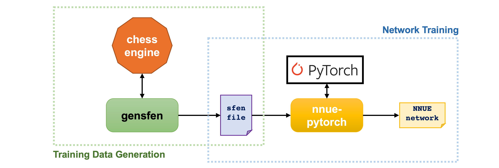
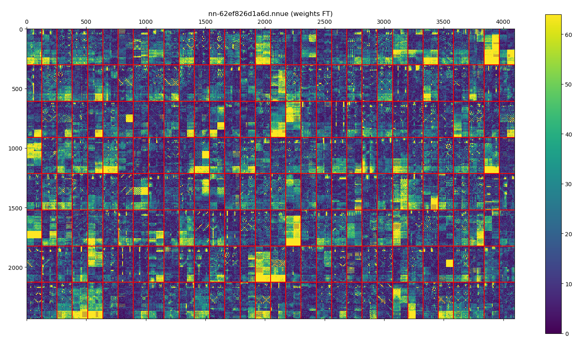
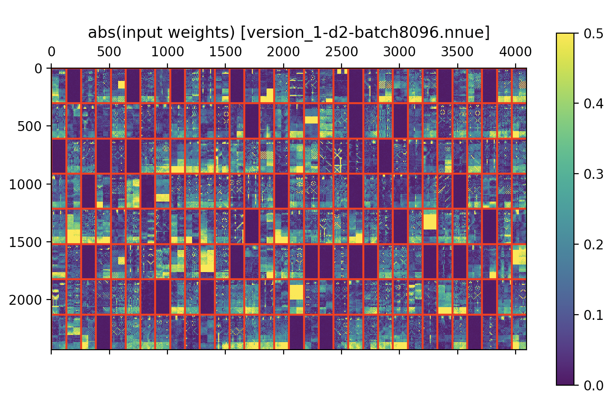
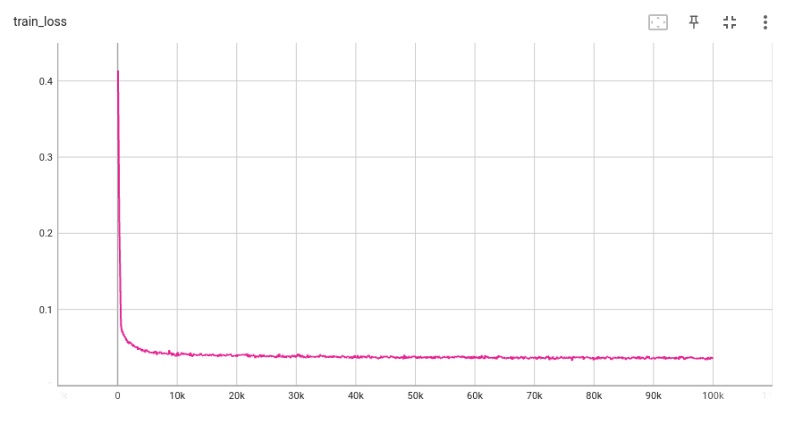
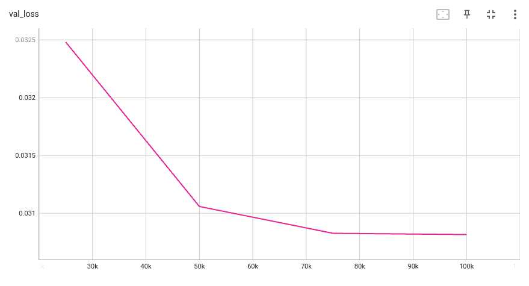

<p align="center">
  
</p>

<!-- <h1 align="center">国际象棋程序Stockfish NNUE设计简介（五）网络训练</h1> -->
<h1 align="center">A Brief Introduction to Stockfish NNUE: (5) Network Training</h1>

<!--
Nodchip实现的原版Stockfish-NNUE已经自带了网络训练的部分。不过大概是出于将引擎本身与网络训练器分开的目的，Stockfish团队后续又开发了nnue-pytorch，利用pytorch库重新实现了一版网络训练器。本文会对这两种实现都做简单的介绍。

NNUE网络训练可以被形式化为一个颇为标准的回归问题。以下给出了一个mini-batch版的回归问题的学习过程的伪代码：
```
foreach epoch:
    foreach min-batch:
        foreach training position p:
             1. Compute its board representation x
             2. Do inference: y' = NNUE(x; w)
        Do loss computation L(Y, Y')
        Do weight optimization: w' = optimize(w, X, Y, Y')
```
以上这段伪代码基本就是NNUE网络训练算法的核心了。简化以后看上去平平无奇，和其他一般的回归问题没有任何区别。如果你对以上学习框架很熟悉的话，那么剩下的工作就好办多了，无非就是将这其中的每一步都具体地实现出来。当然，由于训练样本是国象棋盘局面，在一些细节处理上有特殊之处，然而总体上仍然没有跳出这个骨架。

接下来我会首先介绍一下Nodchip的原版learner的实现。
-->

The original Stockfish-NNUE implemented by Nodchip already has its own network training module. However, probably for the purpose of separating the engine itself from the network trainer, the Stockfish team subsequently developed nnue-pytorch, which re-implemented a version of the network trainer using the pytorch library. This article will briefly introduce both implementations.

NNUE network training can be formalized as a fairly standard regression problem. The pseudocode of the learning procedure of the regression problem with mini-batches is given below:
```
foreach epoch:
    foreach min-batch:
        foreach training position p:
             1. Compute its board representation x
             2. Do inference: y' = NNUE(x; w)
        Do loss computation L(Y, Y')
        Do weight optimization: w' = optimize(w, X, Y, Y')
```
The above pseudo code is basically the core of the NNUE network training algorithm. After simplification, it looks no different from other general regression learning formulations. If you are familiar with the above learning framework, it will be much easier to understand the NNUE network learning. The only remaining task is just to understand each step with slightly more implementation details. Of course, since the training sample is a chess position, some special process about board representation construction  would be needed, but overall it still does not go beyond this framework.

In following subsection, I will first introduce the implementation of Nodchip's original learner.


<!--
### Inference

按照开头伪代码所展示的流程，NNUE的inference应当是比较简单的：

1. 从训练集读取一个局面pos1；
1. 计算pos1的棋盘表示x，以x为输入调用当前网络向前传播得到一个输出值y‘。

不过在实际的实现上，Nodchip版的learner在读取了pos1之后，以pos1为根节点调用了一次安静搜索，然后用搜索返回的PV叶子节点pos2来代替pos1进行后续操作。于是inference的步骤变成了下面这样：

1. 从训练集读取一个局面pos1；
1. 调用安静搜索PV = qsearch(pos1)。取出返回的PV中的叶子局面（也就是最后一个局面）pos2；
1. 计算pos2的棋盘表示x，然后以x为输入调用当前网络向前传播得到一个输出值y‘。

pos2与pos1唯一的区别在于，pos2一定是一个“安静局面”。那么为什么一定要获得安静局面pos2呢？这就不得不简要介绍一下安静搜索，以及它和估值函数的关系。
-->

### Inference

According to the pseudo-code shown at the beginning, the inference of NNUE should be relatively simple:

1. Read a position `pos1` from the training set;
1. Compute the board representation of `pos1`, denoted by `x`, invoke the current network forward propagation with `x` as input to obtain the output value `y'`.

However, in actual implementation, after reading `pos1`, the learner of Nodchip’s version invokes a quiescence search on `pos1` as the root node, and then replaces `pos1` with the PV leaf node `pos2` returned by `qsearch()` for subsequent operations. So the steps of inference become as follows:

1. Read a position `pos1` from the training set;
1. Invoke quiescence search `PV = qsearch(pos1)`. Take out the leaf position (the last position) `pos2` in the returned `PV`;
1. Compute the board representation of `pos2`, denoted by `x`, and then use `x` as input to invoke the current network to propagate forward to get an output value `y'`.

The only difference between `pos2` and `pos1` is that `pos2` must be a "quiet position". So why do we have to obtain this quiet position `pos2`? 
To answer this, we need to briefly introduce the quiescence search and its relationship to the evaluation function.


<!--
### 安静局面与安静搜索

[安静搜索（Quiescence Search）](https://www.chessprogramming.org/Quiescence_Search)最初的目的是为了解决“[水平线效应](https://www.chessprogramming.org/Horizon_Effect)”。最原始的alpha-beta搜索在达到深度限制之后就停止展开，对叶节点调用估值函数后返回估值。然而叶子局面可能处于激烈对抗中，哪怕再走一步，局势就会发生巨大变化（如兵吃后、升变、将军等等）。但是由于不再向前探索，搜索会对即将发生的变化视而不见，而估值函数又很难预测这种巨变局势的最终走向，结果就是返回的估值出现严重失准（仿佛后续棋局的发展如同在地平线以下，并不是不存在，但是因为眼界限制搜索就愣是看不见），这就是“水平线效应”。

|  |
| :---: |
| <em>一个“水平线效应”的示例局面，黑方先行。使用Viper 1.0教学引擎为例，计算机执黑，安静搜索已关闭。可以看到，2层到10层的搜索分数显示，计算机以为自己输定了，于是给出了极低的分数。但11层往上的分数又变成了势均力敌甚至微弱优势。这种巨大的分数波动就是水平线效应造成的</em> |

alpha-beta搜索的目的无非是为了获得每个子局面的准确估值，因此“水平线效应”是必须要解决的问题：它使得返回的估值既不准确也不稳定——不同深度的搜索结果之间甚至会上下剧烈抖动。显然，将深度限制作为搜索树展开的停止条件是有问题的，那么什么才是比较恰当的“停止展开搜索树”的条件呢？

我们不妨把“搜索”和“估值”二者各自的长处拿出来对比一下，不难发现，搜索善于捕捉那些动态的、局势正在剧烈变化的、不稳定的局面，而估值函数则更擅长评估那些相对稳定的、局势明晰的局面。用一个例子做个比喻：假设一个擂台上，两个散打选手正在比赛。双方你一拳我一脚缠斗在一起打的不可开交，这个时候假设你有如同视频播放器一般的魔法，把当前这个场景定格住，然后请一个有经验的专家根据这个场面来预测一下谁占优势，恐怕再有经验也会说不准；相反要是两人脱离接触正在对峙，或者上个回合已经结束，那么让专家做同样的评估就容易多了。并不是说搜索完全无法用于分析稳定的局面，也不是说估值函数完全不能评估剧烈变化的局面，只是要获得可观的效果，付出的代价要大得多。由此可见，为了以最小的代价获得最准确的估值，让搜索和估值函数干好各自最擅长的工作无疑是最佳的策略。于是乎最前面的问题也就有了答案：让搜索停止到局势不再剧烈变化的局面上就是最好的，这就是安静搜索基本的思想。不要忘记，我们最根本的目的是为了获得准确的估值，安静搜索最终能够让搜索结果收敛到一个稳定值上去——稳定了，一般也就准确了。实际上，这种思想并非只应用在alpha-beta搜索中，MCTS在叶子节点处的进行的sampling起到的也是同样的作用。

上文提到的“局势不再剧烈变化的局面”就被称为“安静局面”。具体定义是：如果行棋放的最佳着法不是“战术着法“（[tactical move](https://www.chessprogramming.org/Tactical_Moves)），即执行后不会引起超过一个兵的子力价值的估值波动（相反一个吃子着法会引起至少一个兵的变化），这种局面就被认为是“安静”的。相对应的，“安静搜索”是一个简化版的alpha-beta搜索：即所有不会引起估值剧烈变化的走法都被简化为一个“着法”作为下限，那就是“什么都不做”。这种把“什么都不做”作为下限的假设与空步裁剪的思想非常相似，有一个术语专门描述这种“什么都不做”时的估值，叫做“[standing pat](https://www.chessprogramming.org/Quiescence_Search)”分数（轮空分数）。

回到NNUE的问题上，有了以上这些说明，我们就不难得出以下三个结论：

* 估值函数理论上应该只应用在安静局面上，NNUE网络同理；
* 估值函数实际上也确实只应用在安静局面上，NNUE网络也将会有同样的用法；
* 训练集与测试集的分布应当一致。如果网络的测试/使用都是在安静局面上，那么训练也应该只在安静局面上进行。
-->

### Quiet Position and Quiescence Search

The original purpose of applying [Quiescence Search](https://www.chessprogramming.org/Quiescence_Search) was to resolve the issue of "[horizon effect](https://www.chessprogramming.org/Horizon_Effect)". The most primitive alpha-beta search stops after reaching the depth limit, and returns the value obtained by calling the evaluation function on the leaf node.
However, the leaf position may still be in an unstable status where two sides are in an intense confrontation. The situation might change dramatically (such as pawn captures queen, pawn promotion, checkmate, etc.) even by just making one additional move. But, due to no longer exploring forward, the search will turn a blind eye to the upcoming changes, and it is difficult for the evaluation function to predict the final direction of this dramatic change. As a result, the returned evaluations would be seriously inaccurate (just like things below the horizon: they do exist, but because of the limitation of vision, you can’t see them, thus believe that they do not exist). This is called “horizon effect”.

|  |
| :---: |
| <em>An example position of the "horizon effect", where black is the turn-to-move. Using the Viper 1.0 didactic engine as an example. Engine plays black and Quiescence Search is turned off. It can be seen that the search scores from depth 2 to depth 10 show that the engine believed that it has lost the game, therefore outputted an extremely low score. But the scores after the depth 11 suddenly turned into a draw score or even a slight advantage score. This huge score fluctuation is actually caused by the horizon effect.</em> |

The goal of alpha-beta search is to obtain the accurate evaluation of each position in the search tree, thus "horizon effect" is a problem that must be solved: it makes the returned evaluation neither accurate nor stable - the score difference of search results between the adjacent depths may be very large.
It may even fluctuate up and down across depths violently.
Obviously, it is problematic to only use the depth limit as the stopping condition of the search tree expansion. Then, what is a more appropriate "stopping condition”? <!-- for the search tree expansion? -->

To answer the question above, we might need to look back on the strengths of "search" and "evaluation" respectively, see what they are good at, and whatnot.
It is not difficult to realize that search is good at capturing those dynamic, rapidly changing and unstable situations, while the evaluation function is better at assessing situations that are relatively stable and clear.  <!-- Let’s use an example as a metaphor: suppose that in a ring, two Sanda players are competing. The two sides fight with each other with one punch and one kick. At this time, suppose you have magic like a video player, freeze the current scene, and then ask an experienced expert to predict who will be based on this scene. If you have the upper hand, no matter how experienced you are, you may not be able to say for sure; on the contrary, if the two are out of contact and confronting each other, or the last round has ended, it will be much easier for experts to make the same assessment. 
Note that this doesn’t mean that search is completely incapable of analyzing stable situations, or evaluation function is completely incapable of evaluating dramatically changing situations - it’s just more expensive to achieve meaningful results by doing so. -->
Thus, in order to obtain the most accurate evaluation score with the minimal cost, the best strategy is undoubtedly to let the search and evaluation function do what they are good at most: that is, stopping the search until the position is no longer changing drastically. 
This is the basic idea of quiescence search.
Don't forget that our most fundamental purpose is to obtain accurate evaluation scores. Quiescence search can eventually converge the search results to a stable value - when it is stable, usually it is accurate. In fact, this idea is not only applied in alpha-beta search, the sampling performed by MCTS at the leaf nodes also plays the same role.

The positions that are “no longer changing drastically" mentioned above are called "quiet positions". 
A relatively more formal definition is: if the best move to play is not a “[tactical move](https://www.chessprogramming.org/Tactical_Moves)”, this position is considered "quiet".
Correspondingly, "quiescence search" is a simplified version of standard alpha-beta search:
all moves that do not cause drastic evaluation score changes are simplified to one "move" for the lower bound, that is, "do nothing".
This is based on the assumption that "doing nothing" as the lower limit is very similar to the idea of “null move pruning”. There is a terminology specifically describing the evaluation of this "doing nothing", called "[standing pat](https://www.chessprogramming.org/Quiescence_Search)" score.

Going back to the topic of NNUE, with the above explanations, it is not difficult for us to draw the following three conclusions:

* Theoretically, the evaluation function should only be applied on quiet positions, and the same principle should also applicable to the NNUE network;
* Practically, the evaluation function was actually only applied to the quiet positions, and the NNUE network will have the same usage;
* The distribution of the training set and the testing set should be the same. If the network is tested/used on quiet positions, then training should also be done on quiet positions.


<!--
### Inference中的线上安静搜索是否必要？

不过，即使应该使用安静局面，为什么一定要在inference的过程中在每个局面上线上调用安静搜索来获得安静局面呢？注意这里并非在否定“安静局面”，而是质疑“线上搜索”的必要性。线上调用安静搜索至少有三个缺点：

1. 本来训练部分可以完全不涉及任何国象技术。然而为了调用安静搜索，训练代码就不得不包含国象引擎的代码，因为二者之间无法解耦，这一下就增加了代码的复杂程度；
1. 为了集成国象引擎代码，训练部分的实现方法也受到了限制。比如很多现成的深度学习库的主要实现语言是Python，和主要由C++写成的Stockfish集成在一起不能说不可能，但依旧会很麻烦；
1. 安静搜索哪怕再快也会拖慢inference的速度。实际上网络训练的主要时间都耗费在了inference上，为此Nodchip还实现了一个复杂的多线程并行化inference的任务分发系统；

既然如此，那么为什么一定要在线上做安静搜索呢？保存线下搜索结果可不可以？直接滤掉训练集非安静局面呢？或者更基本的问题：在训练数据中包含非安静局面到底会对棋力造成多大程度的削弱？这些问题原作者似乎也没有给出明确的回答。这里不妨展开探索一下，假如在inference时不在线上调用安静搜索的话，那么可以考虑至少四种替代方案：

1. 读取一个训练局面，在inference时不运行安静搜索，直接在原局面上调用NNUE网络得到估值；
1. 读取一个训练局面，在inference时不运行安静搜索，直接跳过所有“非安静”局面。检查局面是否安静的方法如下：检查该局面的最佳走法move（详见上一篇中PackedSfenValue结构体成员），如果move是“战术着法”（tactical move，例如吃子或升变），则该局面就是“非安静”局面；
1. 在数据生成阶段，以Stockfish的原版估值函数运行一次安静搜索，然后把对应的安静局面保存下来，并替换掉原始局面（相当于扔掉pos1，直接存pos2）。在训练时采用类似（1）的策略；
1. 在数据生成的时候，以Stockfish的原版估值函数运行一次安静搜索，然后把对应的搜索树保存下来。在训练时，不进行动态的安静搜索，而是在静态的搜索树中利用当前NNUE网络获取pos2；

事实上，在后文提到的nnue-pytorch工程中，作为Stockfish开发者的[gladius](https://www.chessprogramming.org/Gary_Linscott)和[Sopel](https://www.chessprogramming.org/Tomasz_Sobczyk)已经进行了一系列实验。我们可以根据他们的实验结果对这四种方案作出一些基本的评估：

1. 方案（1）显然不是个好主意，因为它违反了“只在安静局面上调用估值函数”的原则。然而这个方案到底有多“糟”仍需量化的评估。据在Stockfish-NNUE上的实验结果，“使用包含了非安静局面的训练集训练出的NNUE网络”比“只使用安静局面训练出的网络”，棋力下降了至少100ELO。我在用Senpai 2做的一些实验也表明，哪怕估值函数仅仅是一个线性模型，前者的训练结果也要比后者低出至少60ELO。这个结论还是很惊人的，一个简单的训练数据的筛选就能使棋力提高100ELO，而在其他方面获得同等提升怕不是需要半年甚至更久的努力才有可能。
1. 方案（2）就是nnue-pytorch中使用的方案。在开启了局面过滤之后，会有大约20%～30%的非安静局面被滤除。事实证明这个方案虽然简单却已经足够了。nnue-pytorch使用此方法已经获可以训练出实力与原版相当甚至更强的网络。
1. 方案（3）目前还没有人实验过，不过猜测它的结果应该和（2）类似。因为这个方案中的inference使用的依旧是静态的提前生成的局面，inference本身并不改变局面，与（2）的区别仅仅在于包含了更多的安静局面而已。而通过将方案（2）的初始训练集扩大为原来的125%左右（也就是补齐被滤掉的局面）完全可以达到同样的效果。
1. 方案（4）貌似是最接近Nodchip原版的inference的方法，然而这个方法最大的问题是：存储搜索树局面需要耗费巨大的额外空间。Sopel曾尝试生成这样的数据集，然而结果是训练集大小膨胀了整整15倍，几乎无法存储，最后不得已而放弃。

因此，对于Nodchip原版的带线上安静搜索的inference，我能想到的优势就只有：由于线上使用估值网络进行安静搜索，每个训练局面在不同的epoch中得到的PV是不同的，那么对应的安静局面也将不同，这样可以在不重新生成数据的前提下，能一定程度的增加训练集的多样性。

线上安静搜索的必要性如此值得讨论的一大原因就是它直接决定了Stockfish-NNUE的引擎与训练器能否分离。要知道NNUE一大特点就是使用线下生成的训练数据来训练网络，那么训练数据就应该是训练器唯一的输入。如果引擎与训练器无法分离，而数据生成器又必须依赖引擎，那么数据生成器和训练器也就不能分离。可是这样一来就让生成线下训练数据变成了多此一举的笑话——既然数据生成器和训练器必须在一起，那干嘛不直接现场生成现场训练呢，还能节省一轮硬盘读写的时间。因此，数据生成器和训练器必须能够解耦，对应的也就必须要求训练器不再依赖安静搜索。

|  |
| :---: |
| <em>绿框为训练数据生成模块，蓝框为网络训练模块，箭头表示依赖关系。设想如果图中的灰色箭头变为实线，那么区分绿框和篮框两部分还有什么意义呢？</em> |
-->

### Is Online Quiescence Search Essential in Inference?

However, even though the quiet positions should be used in training, why should we invoke the quiescence search ONLINE on each position during the inference to obtain corresponding quiet position? Note that this is not negating the "quiet positions", but questioning the necessity of "online quiescence search". There are at least three disadvantages to invoking quiescence search online:

1. Originally, the training part did not involve any classical computer chess technology at all. However, in order to invoke quiescence search, the training code has to include the chess playing  code of the original engine, because the two parts (training part and chess playing part) cannot be decoupled, which increases the complexity of the code;
2. In order to integrate the chess playing code, the implementation method of the training part is also limited. For example, the main implementation language of many existing deep learning libraries is Python. It is not totally impossible, but it would be much more complicated and expensive to integrate those libraries with Stockfish, which is mainly written in C++.
3. Even quiescence search is usually much faster than standard alpha-beta search, it would still slow down the inference. In fact, the major time of network training is spent on inference. For this reason, Nodchip implemented a complicate multi-threaded system to parallelize and speedup inference phase;

That being the case, why do you have to do quiescence searches online? Is it possible to save offline search results? What about directly filtering out the non-quiet positions in the training set? Or a more fundamental question: how much does it hurt the network’s chess playing strength by including non-quiet positions in the training data?
To explore a little bit deeper, let’s think about what alternatives could be considered if we do not do the online quiescence search during inference? There are at least 4 options:

1. Read a training position, do not run quiescence search during inference. Instead, directly call the NNUE network on the original position to get the evaluation;
2. Read a training position, do not run quiescence search during inference, and skip all "non-quiet" positions directly. 
The method to check whether a position is quiet or not is as follows: check the best move of the situation move (see the members of the PackedSfenValue struct in the previous article for details), if the move is a "tactical move" (such as capture or promotion), then this position is a "non-quiet" position;
3. In the data generation phase, run quiescence search with the  original Stockfish evaluation function, then save the corresponding quiet positions, and replace the original position (throw away `pos1` and directly save `pos2`).
4. In the data generation phase, run quiescence search with the  original Stockfish evaluation function, and then save the corresponding search tree. During training, do not perform dynamic quiescence search, but use the current NNUE network to obtain `pos2` from that static search tree;

In fact, in the **nnue-pytorch** project, Stockfish developers have conducted a series of experiments. We can make some basic assessments on these four options based on their experimental results:

1. Option (1) is obviously not a good idea, because it violates the principle of "calling the evaluation function only in quiet situations". However, how "bad" this plan is still needs to be quantitatively assessed. According to the experimental results on Stockfish-NNUE, "the NNUE network trained using the training set that includes non-quiet positions" is at least 100 ELO lower than the "network trained using only quiet positions". Some experiments I did with Senpai 2 also showed that even if the evaluation function is just a simple linear model, the training result of the former is at least 60 ELO lower than that of the latter. This conclusion is quite astonishing. A simple selection of training data can improve engine strength by 100 ELO. It may take half a year or even longer to achieve the same level of improvement in other aspects.
2. Option(2) is just the approach used in nnue-pytorch. After enabling the training position filtering, about 20% to 30% of non-quiet positions will be filtered out. Experiments have proved that this solution, although simple, is sufficient. Using this method, nnue-pytorch has been able to train a network that is comparable to or even stronger than the original non-NNUE version of Stockfish.
3. Option (3) has not been tested yet, but it is guessed that its result should be similar to (2). Because the inference in this approach still uses a static pre-generated position, the inference itself does not change the position, and the difference between (3) and (2) is only that (3) includes more quiet positions. The same effect can be achieved by expanding the initial training set of option (2) to about 125% of the original size.
4. Option (4) seems to be closest to Nodchip's original inference method, but the biggest problem with this method is that it takes a huge extra space to store the search tree positions. Sopel once tried to generate such a data set, but the size of the training set expanded by almost 15 times, which was almost impossible to store, and finally he had to give up.

Therefore, for Nodchip's original inference with online quiescence search, the only advantage I can think of is: due to the online use of the evaluation network for quiescence search, the PV obtained in different epochs for each training situation is different, then. The corresponding quiet position will also be different, so that the diversity of the training set will slightly increase without regenerating the data.

The reason why the necessity of online quiescence search is worth discussing is because this directly determines whether the engine and trainer of Stockfish-NNUE can be separated or not. 
You might have known that a major feature of NNUE is to use offline-generated training data to train the network, so the training data file should be the only input to the trainer. 
If the engine can not be separated from the trainer, and the data generator must depend on the engine, then the data generator and the trainer can not be separated either. 
But in this way, “generating offline training data” becomes a joke - since the data generator and trainer must be together, why not directly generate online during training? Therefore, the data generator and the trainer must be decoupled, and the trainer must no longer rely on quiescence search.

|  |
| :---: |
| <em>The green box is the training data generation module, the blue box is the network training module, and the arrow indicates the dependency. Imagine if the gray arrow in the figure turns into a solid line, what is the point of distinguishing between the green box and the blue box?</em> |


<!--
### Loss Functions

Nodchip原版的learner中实现了至少四种loss。如果初次阅读loss定义部分的代码，可能会被各种编译器预处理开关给转晕了。比如你会看到至少四个不同的编译开关变量：

* *LOSS_FUNCTION_IS_**CROSS_ENTOROPY_FOR_VALUE***
* *LOSS_FUNCTION_IS_**WINNING_PERCENTAGE***
* *LOSS_FUNCTION_IS_**CROSS_ENTOROPY***
* *LOSS_FUNCTION_IS_**ELMO_METHOD***

每一个开关变量对应一种loss。作者在最终版本中采用的是最后一个：**ELMO_METHOD**。我会对每一个都简要介绍一下，不过最后你会发现这四个loss说的其实是一码事。先介绍几个代码中可能会看到的名词。
-->

### Loss Functions

There are four different losses implemented in Nodchip's learner.
If you read the code relevant to the loss definition for the first time, you might be confused by various compiler preprocessing switches. For example, you will see at least four different compile switch variables:

* *LOSS_FUNCTION_IS_**CROSS_ENTOROPY_FOR_VALUE***
* *LOSS_FUNCTION_IS_**WINNING_PERCENTAGE***
* *LOSS_FUNCTION_IS_**CROSS_ENTOROPY***
* *LOSS_FUNCTION_IS_**ELMO_METHOD***

Each switch variable above corresponds to a specific loss. Nodchip applied the last one in the final version: **ELMO_METHOD**. I'll give a brief introduction to each of the four, but in the end you'll find that these four losses actually mean the same thing. 

First, let me introduce a few terminologies that might be seen in the code.


<!--
### deep value 与 shallow value

在Nodchip版的训练器代码中，label值被叫做“deep value”，预测值被叫做“shallow value”。deep value是从训练集中直接读取的，也就是每个训练样本中的score部分（参考上一篇中的PackedSfenValue结构体）。之所以叫“deep value”，顾名思义，是因为这个值是Stockfish使用原版估值函数调用alpha-beta搜索若干层后返回的值，也就是“经过一定深度的搜索得到值”。相应的，“shallow value”就是直接通过网络向前传播得到的估值，或者以网络为估值函数进行一次安静搜索得到的值，总之就是在不调用alpha-beta搜索时得到的值。

正如前文提到的，我们一般认为，经过搜索返回的的估值往往比直接调用估值函数得到估值更加准确。基于此假设，训练的目标也就一目了然了：我们希望NNUE网络输出的估值与使用原版估值函数经过若干层搜索后返回的估值一样准确，也就是希望shallow value与deep value尽可能的接近。

|  |
| :---: |
| <em>shallow value与deep value示意图。左侧为shallow value：在输入局面上直接调用估值函数获得；右侧为deep value：以输入局面为根节点调用一次d层（这里d = 10）的alpha-beta搜素获得</em> |
-->

### "Deep Value" and "Shallow Value"

In the Nodchip's version of the trainer code, the label value is called "deep value", and the predicted value is called "shallow value". The deep value is read directly from the training set, that is, the `score` field of each training example (see the `PackedSfenValue` struct in the previous article). 
The reason why it is called "deep value", as the name suggests, is because this value is "the value obtained after a certain depth of search". 
Remember that in the data generation phase, for each position we let Stockfish run a `d`-depth alpha-beta search using its original evaluation function and store the returned score.
Respectively, "shallow value" is the evaluation obtained by directly propagating forward through the network (or more accurately: the value obtained by performing a quiescence search with the network as the evaluation function). It is the value obtained when the alpha-beta search is not called.

As mentioned above, we believe that, generally, the evaluation returned by the search is usually more accurate than the evaluation obtained by directly calling the evaluation function/network. Based on this assumption, the goal of the training is clear: we hope that the evaluation output by the NNUE network is as accurate as the score returned by `D`-depth search using the original evaluation function. In other words, we hope that the shallow value and the deep value could be as close as possible.

|  |
| :---: |
| <em>Diagram of "shallow value" and "deep value". Shallow value on the left: obtained by directly calling the evaluation function on the input position; deep value on the right: obtained by calling an alpha-beta search of depth `d` (here `d` = 10) with the input position as the root node</em> |


<!--
### winning_percentage函数

这是一个将估值转化为当前行棋方取胜概率的函数（公式）。这个看上去挺复杂的公式是源于一项2007年的研究成果[^1]，感兴趣的话可以去它的[wiki页面](https://www.chessprogramming.org/Pawn_Advantage,_Win_Percentage,_and_Elo)了解一下。大概就是拟合了一下估值和最终胜负结果之间的数值关系。原始的公式如下：

$$W(P)=\frac{1}{1+10^{-P/4}}$$

其中W指取胜概率，P是经过“兵值归一化”之后的估值。所谓“兵值归一化”是指按照兵的子力价值是1.0的标准对原始估值进行缩放。比如，假设你的估值是350，你的兵的“子力价值”是100，那么P = 350 / 100 = 3.5。（[具体可以参考这里](https://www.chessprogramming.org/Point_Value)）

进一步的，作者通过换底公式把原函数中的底数10换成了e，这样W(P)就有了类似sigmoid函数的形式（不太清楚为什么转换为sigmoid形式，猜测可能是求导方便？）：

$$
\begin{align}
W(P) &= \frac{1}{1+10^{−P/4}} \nonumber\\
     &= \frac{1}{1+\exp(−P/4*\log(10))} \nonumber\\
     &= sigmoid(P/4*\log(10)) \nonumber
\end{align}
$$

在此基础上，再把"兵值归一化"的计算过程 P = value / PawnValueEg 代入，于是得到了最终形式：
```
winning_percentage(value) = sigmoid(value / PawnValueEg / 4.0 * log(10.0))
```
其中value是未经归一化的估值，PawnValueEg指Stockfish的残局兵的子力价值。
-->

### `winning_percentage()` Function

This is a function (formula) that converts an evaluation score into the winning probability for the current side-to-move player. 
It is derived from a research in 2007[^1].
This research explores the approximate relations between win percentage, pawn advantage, and ELO rating advantage for computer chess.
If you are interested, please go to this [wiki page](https://www.chessprogramming.org/Pawn_Advantage,_Win_Percentage,_and_Elo) to learn more about it.
The original formula is as follow:

$$W(P)=\frac{1}{1+10^{-P/4}}$$

where `W` denotes the probability of winning, and `P` is the evaluation score after "[centipawn](https://www.chessprogramming.org/Centipawns) normalization". Centipawn normalization scales the original evaluation so that the material value of each pawn is exactly 1.0.
For example, if your evaluation is 350 and your pawn material value is 100, then P = 350 / 100 = 3.5. For more details, please see [this page](https://www.chessprogramming.org/Point_Value).

Furthermore, the author replaced the base $10$ in the original function with $e$, so that `W(P)` has a similar form to the sigmoid function (I am not clear why Nodchip did this conversion. Probably because it is more convenient to compute gradient with sigmoid function?):

$$
\begin{align}
W(P) &= \frac{1}{1+10^{−P/4}} \nonumber\\
     &= \frac{1}{1+\exp(−P/4*\log(10))} \nonumber\\
     &= sigmoid(P/4*\log(10)) \nonumber
\end{align}
$$

Based on this, we can then plugin the "centipawn normalization" expression `P(value) = value / PawnValueEg` to obtain the final form:
```
winning_percentage(value) = sigmoid(value / PawnValueEg / 4.0 * log(10.0))
```
In this final form, `value` is the input unnormalized evaluation, and `PawnValueEg` the pawn material value of Stockfish in endgames (most engines would give different piece material values in midgames and endgames).


<!--
### MSE Loss 与 Cross-Entropy Loss

Nodchip的代码中用到了两种基础loss：

1. **Mean Square Error**: $L_{MSE}(Y,\hat{Y})=\frac{1}{n}\sum_{i}^{n}(y_i-\hat{y_i})^2\displaystyle$
1. **Cross-Entropy**: $L_{CE}(Y,\hat{Y})=-\frac{1}{n}\sum_{i}^{n}\left[ y_i\log(\hat{y_i}) + (1-y_i)\log(1-\hat{y_i}) \right]\displaystyle$

其中，MSE Loss的输入值域可以是任意范围，而Cross Entropy Loss的输入必须是概率，也就是输入值域必须为[0, 1]。
-->

### MSE Loss and Cross-Entropy Loss

There are two basic losses used in Nodchip's code:

1. **Mean Square Error**: $L_{MSE}(Y,\hat{Y})=\frac{1}{n}\sum_{i}^{n}(y_i-\hat{y_i})^2\displaystyle$
1. **Cross-Entropy**: $L_{CE}(Y,\hat{Y})=-\frac{1}{n}\sum_{i}^{n}\left[ y_i\log(\hat{y_i}) + (1-y_i)\log(1-\hat{y_i}) \right]\displaystyle$

Among them, the input value of MSE Loss could be in any range, and the input of Cross Entropy Loss must be probability, which means that the input value range must be [0, 1].


<!--
### p、q、t、m变量

这四个变量在NNUE计算loss的代码中会经常见到（虽然名字可能是随便起的），他们其实都是标准化为概率后的结果，这里简要介绍一下：

* **p**：即 winning_percentage(deep_value)。
* **q**：即 winning_percentage(shallow_value)
* **t**：即标准化为概率的game_result。从PackedSfenValue中读取的game_result的值域为{-1, 0, +1}，-1表示己方输，+1表示己方赢，0表示和棋。通过t = (game_result + 1) / 2，就将game_result转化为了概率。
* **m**：即p和t的加权平均。二者各自的权重由参数lambda控制：**m = lambda * p + (1 - lambda) * t**，lambda $\in [0,1]$。

简单总结就是：q是预测值，p和t是两种标签值，而m是两种标签的综合（加权平均）。权重lambda作为学习参数需要在训练开始前指定（默认1.0，也就是不使用game_result）。前文我们曾提到，NNUE使用对局结果对训练估值进行了校正，而此处的加权平均m正是实现这种“校正”的方法。
-->

### `p`, `q`, `t` and `m` Variables

These four variables are often seen in NNUE's code for computing loss (although the names were probably given randomly). They are actually the probabilities after normalization. Here is a brief introduction to each of them:

* **p**: output of `winning_percentage(deep_value)`
* **q**: output of `winning_percentage(shallow_value)`
* **t**: the game_result normalized to probability. The value range of game_result read from PackedSfenValue is $\{-1, 0, +1\}$, -1 means that one's side loses, +1 means that one's own side wins, and 0 means a draw. By `t = (game_result + 1) / 2`, the game_result is converted into a probability.
* **m**: the weighted average of `p` and `t`. The respective weights of the two are controlled by the parameter lambda: `m = lambda * p + (1 - lambda) * t`，lambda $\in [0,1]$。

A brief summary: `q` is the predicted value, `p` and `t` are the two label values, and `m` is the combination (weighted average) of the two labels. 
The weight `lambda` needs to be specified as a learning parameter before training starts (the default is 1.0, that is, `game_result` is not used). We once mentioned that NNUE uses game results to  the training evaluation, and the weighted average `m` here is for implementing this "correction".


<!--
### 四种loss与他们的演进关系的猜测

有了以上这些名词解释，我们就可以用以下表格总结出四种loss的不同之处：

| **Loss名称** | **基础loss** | **标签值** | **预测值** |
| :--     | :--     | :--   | :--  |
| **CROSS_ENTOROPY_FOR_VALUE** | Mean Square Error | deep_value | shallow_value |
| **WINNING_PERCENTAGE**       | Mean Square Error | p | q |
| **CROSS_ENTOROPY**           | Cross-Entropy     | p | q |
| **ELMO_METHOD**              | Cross-Entropy     | m | q |

那么作者为毛要搞四种不同的loss呢？在我看来，这四个loss的变化和演进无意中揭示了作者对loss不断改进的过程。我们不妨大胆猜测一下Nodchip在设计loss时的思路历程：

1. 首先是作者使用了最为简单的MSE，将NNUE的学习问题直截了当的形式化为经典的回归问题，其中predict值就上面提到的shallow_value，label值就是deep_value，于是就得到了第一个CROSS_ENTOROPY_FOR_VALUE（虽然这个名字可能是后来加上的）；
1. 后来作者开始考虑把game_result也加到目标值当中去。然而，deep_value和game_result这两个目标值的值域根本不一致。game_result的值域是{-1, +1}，deep_value或shadow_value是[-32000, +32000]。于是作者使用了一个归一化函数winning_percentage()，利用放缩外加一个sigmoid函数将所有的估值都转换为了“取胜概率”。这样两种label的值域就都是[0, 1]了。为了测试一下这个loss好不好用，作者没有一上来就引入game_result，而是仍然使用概率归一化后的deep_value与shallow_value（也就是p、q）作为loss输入，于是就得到了第二个loss WINNING_PERCENTAGE；
1. 接着，在求导的过程中作者发现，因为在winning_percentage中引入了一个sigmoid函数，那么相应的MSE loss的导数总是挂着一个蛋疼的dsigmoid函数（sigmoid的导函数），颇为丑陋。于是作者想到了sigmoid或者softmax的好基友Cross-Entropy函数：二者配合使用时，在求导过程中，前者的$\exp()$和后者的$\log()$会相互抵消，最终得到一个和MSE导数一致的减法形式的导数。于是作者把MSE改成Cross-Entropy，这就是第三个loss CROSS_ENTOROPY；
1. 最后，作者在这个基础上引入了game_result，将归一化之后的deep_value和game_result（也就是p和t）的加权平均作为label（也就是m）代入cross_entropy，就得到了最终的ELMO_METHOD。

所以，看似是四种loss，其实说的都是一码事：都是对标准回归问题的loss的基于不同动机的改进。
-->

### The Evolution of four Losses

With all terminologies introduced above, we can use the following table to summarize the differences between the four losses:

| Loss Name | Base Loss | Label Value | Predict Value |
| :--     | :--     | :--   | :--  |
| **CROSS_ENTOROPY_FOR_VALUE** | Mean Square Error | deep_value | shallow_value |
| **WINNING_PERCENTAGE**       | Mean Square Error | p | q |
| **CROSS_ENTOROPY**           | Cross-Entropy     | p | q |
| **ELMO_METHOD**              | Cross-Entropy     | m | q |


So why does the author want to introduce four different losses? What's the motivation of doing so? 
In my opinion, the changes and evolution of these four losses inadvertently reveal the author's process of continuously improving the losses. 
We might make a reasonable guess about Nodchip's idea when designing loss:

1. First, the author uses the simplest MSE to formalize the learning problem of NNUE into a classic regression problem. The predict value is the `shallow_value` mentioned above, and the label value is `deep_value`, so the first `CROSS_ENTOROPY_FOR_VALUE` is obtained (although The name may have been added later);
2. Later, the author began to consider adding `game_result` to the target value. However, the ranges of the two target values, deep_value and game_result, are not consistent. The range of `game_result` is {-1, +1}, and `deep_value` or `shadow_value` is [-32000, +32000]. So the author applied a normalization function `winning_percentage()`, which uses a scalar plus a sigmoid function to convert all evaluation scores into "winning probability". In this way, both ranges of the two labels are now within [0, 1]. 
In order to test the performance of this loss, the author did not introduce `game_result` immediately, but still used the probability normalized `deep_value` and `shallow_value` (that is, `p`, `q`) as loss input, thus the second loss `WINNING_PERCENTAGE` was obtained;
3. Then, during the procedure of taking the gradient, the author found that because a sigmoid function was introduced in `winning_percentage()`, the derivative of the corresponding MSE loss always had a painful `dsigmoid` function (the derivative function of sigmoid), which was ugly and annoying.
So the author introduced the Cross-Entropy function, the buddy of sigmoid or softmax function: when these two are used together, during the process of taking derivative, the former's $exp()$ and the latter's $log()$ will cancel each other out. A derivative in the form of subtraction that is consistent with the MSE derivative is obtained. So the author changed its base loss from MSE to Cross-Entropy, which is the third loss `CROSS_ENTOROPY`;
1. Finally, the author formally introduced `game_result`, and substituted the weighted average of the normalized `deep_value` and `game_result` (`p` and `t`) into cross_entropy as the label (`m`) to obtain the final `ELMO_METHOD`.

Therefore, the four different losses are talking about the same thing: they are all improvements to the loss of the standard regression problem based on different motivations.


<!--
### learner训练过程中显示的loss

我们已经知道learner最终使用的是ELMO_METHOD，然而learner在训练过程中依旧会输出很多不同名字的loss值，让人费解。比如像下面这样：
```
PROGRESS: Fri Sep 25 12:38:26 2020, 4455000015 sfens, iteration 4455, eta = 0.25, hirate eval = 109 ,
test_cross_entropy_eval = 0.262824 , test_cross_entropy_win = 0.142044 , test_entropy_eval = 0.221711 , 
test_entropy_win = -9.99999e-07 , test_cross_entropy = 0.262824 , test_entropy = 0.221711 , 
norm = 1.07618e+09 , move accuracy = 36.1626% , 
learn_cross_entropy_eval = 0.290224 , learn_cross_entropy_win = 0.182584 , learn_entropy_eval = 0.255716 , 
learn_entropy_win = -1e-06 , learn_cross_entropy = 0.290224 , learn_entropy = 0.255716
```
其实这些值大部分只是用来参考，或用于debug。

我们在前文已提到，预测值只有q，但目标签值可以有三个：p、t、m。所以理论上，我们可以让p和每个标签值都算一次loss，如此就得到至少三个不同的Cross-Entropy loss值：

* **cross_entropy**：即Cross-Entropy(m, q)，这是真正的ELMO_METHOD loss的值；
* **cross_entropy_eval**：即Cross-Entropy(p, q)，其名字中的“eval”指的就是p；
* **cross_entropy_win**：即Cross-Entropy(t, q)，其名字中的“win”指的就是t；

此外，作为参考值作者还让p、t、m各自和自己计算了个entropy（因为和自己计算，也就没有“cross”什么事了，所以名字就是把上面三个的“cross”直接拿掉）。注意这三个值都是常量，他们是不会随训练进行而改变的，所以纯为参考值：

* **entropy**：即Cross-Entropy(m, m)；
* **entropy_eval**：即Cross-Entropy(p, p)，其名字中的“eval”指的就是p；
* **entropy_win**：即Cross-Entropy(t, t)，其名字中的“win”指的就是t；

最后，每个loss值的前面都会有“**learn_**”或者“**test_**”这样的前缀，表示是在训练集或验证集上计算出的loss。

除了loss，learner还会在验证集上计算一个move accuracy。其方法就是让搜索使用当前的NNUE网络估值函数搜索出一个最佳着法，然后拿它和PackedSfenValue中的move相比较，如果一致就在分子上加一，最后除以数据集的大小得到accuracy。一般这个move accuracy会在30%左右。它能够一定程度地反映网络水平的下限，有助于观察早期训练的进展（但后期这数字变化就不大了）。
-->

### The Loss Displayed during Training

We have already known that the learner eventually applied `ELMO_METHOD` loss for training, but the learner will output a bunch of other loss values ​​​​with different names after some iterations during training, which is confusing. For example:
```
PROGRESS: Fri Sep 25 12:38:26 2020, 4455000015 sfens, iteration 4455, eta = 0.25, hirate eval = 109 ,
test_cross_entropy_eval = 0.262824 , test_cross_entropy_win = 0.142044 , test_entropy_eval = 0.221711 , 
test_entropy_win = -9.99999e-07 , test_cross_entropy = 0.262824 , test_entropy = 0.221711 , 
norm = 1.07618e+09 , move accuracy = 36.1626% , 
learn_cross_entropy_eval = 0.290224 , learn_cross_entropy_win = 0.182584 , learn_entropy_eval = 0.255716 , 
learn_entropy_win = -1e-06 , learn_cross_entropy = 0.290224 , learn_entropy = 0.255716
```
In fact, most of these values ​​are just baseline values, or for debugging only.

As we mentioned above, the only predicted value is `q`, but there could be three label values: `p`, `t`, and `m`. 
So theoretically, we can let q combine with each label value for computing a loss, and get at least three different Cross-Entropy loss values:

* **cross_entropy**: `Cross-Entropy(m, q)`, which is the actual value of ELMO loss;
* **cross_entropy_eval**: `Cross-Entropy(p, q)`, the "eval" in its name refers to p;
* **cross_entropy_win**: `Cross-Entropy(t, q)`, the "win" in its name refers to t;

In addition, as a baseline value, the author also uses `p`, `t`, and `m` to compute an entropy against themselves (because they are computed against themselves, there is no "cross" anymore. So the term "cross" is removed from their original names). Note that these three values ​​are always constants - they will never change with the progress of training:

* **entropy**: `Cross-Entropy(m, m)`;
* **entropy_eval**: `Cross-Entropy(p, p)`, the "eval" in its name refers to p;
* **entropy_win**: `Cross-Entropy(t, t)`, the "win" in its name refers to t;

Finally, each loss name could be preceded by a prefix such as "**learn_**" or "**test_**", indicating that the loss is computed on the training set or validation set.

Besides the loss, the learner also computes a move accuracy on the validation set.
The accuracy is obtained in this way: 
First, for each position in the validation set, run search with the current NNUE network as evaluation function to get a base move. Second, check whether this move is consistent with the move in `PackedSfenValue` or not.
Finally, compute the percentage of consistent best moves among the entire validation set as the move accuracy. 
The move accuracy will be around 30% on average. To some extent, it can reflect the quality of the trained network, and helps users to observe the progress of training in early stages (but as the training goes, this accuracy will converge and remain stable for a long time).


<!--
### Optimization

这一部分相对简单。Nodchip在他的代码中实现了两种update方法：SGD和AdaGrad。根据他的评价，SGD占用内存少，但是准确性捉急；相比较而言AdaGrad更加稳定。作者最终选择了后者。
-->

### Optimization

This part is relatively simple. Nodchip integrated two weight update algorithms in his code: Stochastic Gradient Descent (SGD) and Adaptive Gradient (AdaGrad). According to his comment, SGD takes up less memory, but the learning result is not the best; on the other hand, AdaGrad outputs a better weight and is more stable. Nodchip eventually chose the latter one, but you can always set this in the input options.


<!--

### nnue-pytorch

前文已经提到了，NNUE的一大特色就是它的训练仅需要预生成的数据作为输入，而不是在对局中动态的生成训练数据。对局过程（哪怕是self-play）是需要引擎参与的，但是读取数据和训练网络并不会用到引擎，于是让训练器与国象引擎解耦就成为了一种很自然的想法。训练器也可以有更加灵活的实现——比如说使用功能更强大的深度学习框架PyTorch去实现训练器。nnue-pytorch工程就是基于这样的想法而诞生的。



nnue-pytorch（[Github repo](https://github.com/glinscott/nnue-pytorch)）最早由gladius等Stockfish开发测试团队的成员及爱好者在2020年11月启动，Nodchip也参与其中。repo的创建者gladius[在TalkChess论坛里发了个帖子](https://www.talkchess.com/forum3/viewtopic.php?f=7&t=75724)，将主要进展都更新在里面。截止到2021年1月，nnue-pytorch已经可以训练出与Stockfish的master branch实力相当的网络（差5 ELO，基本可以忽略不计），已经可以比拟Nodchip的原版训练器了。

我简要的翻译了一下gladius在他的贴子的最后一次更新中提到的小改进：

1. 做了大量实验来确定生成最佳训练数据的方法。目前最佳的训练数据是靠如下方法生成：先生成一盘包含一定随机性的完整对局，然后对对局中的每个局面用9层的搜索重新赋予估值。（按理说数据生成与训练器本身无关，但仍然与最后结果有关，所以算是对“训练”的整体改进）；
2. 更换了优化器：目前使用ranger optimizer（貌似是对Adam算法的改进实现？）：[Ranger-Deep-Learning-Optimizer](https://github.com/lessw2020/Ranger-Deep-Learning-Optimizer)；
3. 可视化了网络的活跃度，发现pytorch训练出的网络有很多“死神经元”，这促使“我们”对Adam优化器参数的进一步调整。具体来说，Adam算法里的eps值对死神经元有很大影响。怀疑这可能跟训练过程中过小的loss值有关。具体背景请详见 [https://github.com/glinscott/nnue-pytorch/issues/17](https://github.com/glinscott/nnue-pytorch/issues/17)与[https://github.com/official-stockfish/Stockfish/issues/3274](https://github.com/official-stockfish/Stockfish/issues/3274)；
4. 把估值的放缩因子从600改回到361（这里解释一下：在上面loss部分，我们曾提到winning_percentage(value) = sigmoid(value / PawnValueEg / 4.0 * log(10.0)) 。这里边只有value是变量，后边的 PawnValueEg / 4.0 * log(10)都是常量。也就是说value除以了一个常数放缩因子，然后才被带入到loss函数中。那么同样的，在求导过程中，你的梯度依然需要带着这个常数放缩因子，而与此同时梯度在做weight update时还需要乘以learning rate，于是最终实际上的learning rate其实是参数指定的learning rate除以放缩因子。换句话说，这个放缩因子其实扮演了部分learning rate的角色，这就是为什么他们不断的在调试这个参数，其实是在调试learning rate。这个放缩因子在Nodchip的原版训练器中是PawnValueEg * 4.0 / log(10) = 206 / 4.0 * 2.30256 = 大约360，取整为361。gladius他们刚开始时大概是嫌361太小就把这个值改成了600，如今又改回了361，可能这个值确实有它的道理）；
5. 引入了“退火”机制：learning rate在每75个epoch之后，缩减为之前的0.3倍；
6. 引入了数据洗牌。由于训练需要多次遍历数据集，洗牌帮助良多；
7. 每次只使用整个训练数据中（随机选取出的）的N个局面（大概类似于Ensemble方法中的Bagging？）；
8. 将batch size由16384改为8192。

以上仅是帖子中提到的nnue-pytorch最新的改进。除此之外，改进data pipeline，使用C++实现文件读取、训练局面解码等功能，应用sparse tensor等等都大大改善了训练速度和质量。其中最重要的一项就是加入了训练局面筛选功能，例如允许用户将非安静局面筛除，如我们在Inference部分描述的那样。

-->


### nnue-pytorch

As mentioned above, a major feature of NNUE is that its training only requires pre-generated data as input, rather than dynamically generating training data during the game. The game process (even self-play) requires the participation of the engine, but the engine is not used for reading data and training the network, so it is a natural idea to decouple the trainer from the chess engine. 

The trainer can also have a more flexible implementation - for example, use the more powerful deep learning library _PyTorch_ to implement the trainer. The _nnue-pytorch_ project was started based on this idea.


nnue-pytorch ([Github repo](https://github.com/glinscott/nnue-pytorch)) was first launched in November 2020 by the Stockfish development and testing team. Nodchip also participated in this project. Gladius, the creator of the repo, published a [post on the TalkChess forum]((https://www.talkchess.com/forum3/viewtopic.php?f=7&t=75724)), updating the main progress in the discussion threads.
By Jan 2021, nnue-pytorch has been able to train a network comparable to Stockfish's master branch (the difference is 5 ELO, which is basically negligible), and it can already work as good as the Nodchip's original trainer.


I just copied the itermized improvements of nnue-pytorch that gladius mentioned in the last (Jan 9, 2021) message of his post:

> 1. A ton of experimentation on the best data to use. Current best data uses generated games with a fair bit of randomness, then rescored using a d9 pass after the fact.
> 2. Switching to using the ranger optimizer: [https://github.com/lessw2020/Ranger-Deep-Learning-Optimizer](https://github.com/lessw2020/Ranger-Deep-Learning-Optimizer)
> 3. Visualizing the activations of the net, discovering that the pytorch trained nets had numerous dead neurons. That led to further tuning of the optimizer parameters (in particular, the ADAM eps value had a large effect on the dead neurons - suspicion is this comes from the very low loss values that we typically see during training). See [https://github.com/glinscott/nnue-pytorch/issues/17](https://github.com/glinscott/nnue-pytorch/issues/17) and [https://github.com/official-stockfish/Stockfish/issues/3274](https://github.com/official-stockfish/Stockfish/issues/3274) for background.
>
> Eg. compare master net:
> 
> 
> vs old pytorch net:
> 
> 4. Switching scaling of the evaluations to 361 from 600 (I had mentioned this earlier, but it did end up being beneficial).
> 5. Introducing learning rate drops by 0.3x every 75 epochs.
> 6. Shuffling the input data. We do multiple passes through the data, so shuffling helped a lot.
> 7. Only using every N positions in the data (eg. 7). This helps so that each batch gets to see more variety of games, as opposed to a bunch of positions from one game. We end up seeing all the data in multiple passes through, so it doesn't reduce the effective data size.
> 8. Reducing batch size from 16384 to 8192.

Besides improvements mentioned in the post, nnue-pytorch developers also improved the data pipeline (using C++ to reimplement data loader modules such as file reading and training situation decoding) and applied sparse tensors. All these had greatly speeded up the training process.
nnue-pytorch provides a variety of options of training position filtering, such as "non-quiet position filter", "random position filter", etc., which dramatically enhanced the robustness of training and the quality of trained network, as we described in the Inference section.


### nnue-pytorch First Try

To have a better understanding about nnue-pytorch, I also tried to train a network using the generated data by myself. The following is the plot of losses by iteration on the train set and validation set:

|  |
|    |
| :---: |
| <em>Cross-entropy losses vs training iteration plot on train and validation set. </em> |

To test the strength of the trained network, I use Stockfish 13 engine to load this network and play a tournament against the official Stockfish 13 (using the best network `nn-62ef826d1a6d.nnue` by Aug 2021) for 800 games. Here is the output of [BayesELO](https://www.remi-coulom.fr/Bayesian-Elo/):

| Rank Name | Elo | + | - | games | score | oppo. | draws |
| :-- | :--: | :--: | :--: | :--: | :--: | :--: | :--: |
| **Official Stockfish 13**    | 	60  | 10 | 10 | 800 | 71% | -60 | 58% |
| **Stockfish 13 with my net** |  -60 | 10 | 10 | 800 | 29% | 60  | 58% |

The results in the table shows that the engine with my trained network is around 120 ELO weaker than the official Stockfish 13. Given the fact that I did not put too much time into carefully generating the training data and tuning the learning parameters, such a result is not bad in my opinion.


----

<!--
### PS：

* 当前的Stockfish-NNUE的训练数据生成已经不再使用Nodchip的原版生成器了，而是用如下版本（其实是官方Stockfish的一个branch）：[GitHub - official-stockfish/Stockfish at tools](https://github.com/official-stockfish/Stockfish/tree/tools)
* nnue-pytorch的文档部分包含了一个对NNUE非常详细的介绍（详细到我都觉得我这个系列写了个寂寞），包含了很多图和代码，感兴趣的话推荐一看：[https://github.com/glinscott/nnue-pytorch/blob/master/docs/nnue.md](https://github.com/glinscott/nnue-pytorch/blob/master/docs/nnue.md)
-->

### PS:

* The current Stockfish-NNUE training data generation is no longer using the original Nodchip’s generator. Instead, developers start to use the following version (it is actually a branch of the official Stockfish): [GitHub - official-stockfish/Stockfish at tools](https://github.com/official-stockfish/Stockfish/tree/tools)
* The documents of nnue-pytorch contains a very detailed introduction to NNUE networks, including a lot of pictures and codes. If you are interested, please take a look: [https://github.com/glinscott/nnue-pytorch/blob/master/docs/nnue.md](https://github.com/glinscott/nnue-pytorch/blob/master/docs/nnue.md)
* This series of articles were originally written in winter 2020. The architecture of the network has evolved a lot since summer 2021, and was no longer compatible with the architecture introduced in this article series. The last official Stockfish release that supports the architecture (HalfKP_256X2_32_32) in this article series is [Stockfish 13](https://stockfishchess.org/blog/2021/stockfish-13/). Check [here](https://github.com/glinscott/nnue-pytorch/blob/master/docs/nnue.md#architectures-and-new-directions) to learn more about the latest network architecture updates.

### References

[^1]: Shogo Takeuchi, Tomoyuki Kaneko, Kazunori Yamaguchi, Satoru Kawai. Visualization and Adjustment of Evaluation Functions Based on Evaluation Values and Win Probability. AAAI 2007 https://www.aaai.org/Papers/AAAI/2007/AAAI07-136.pdf