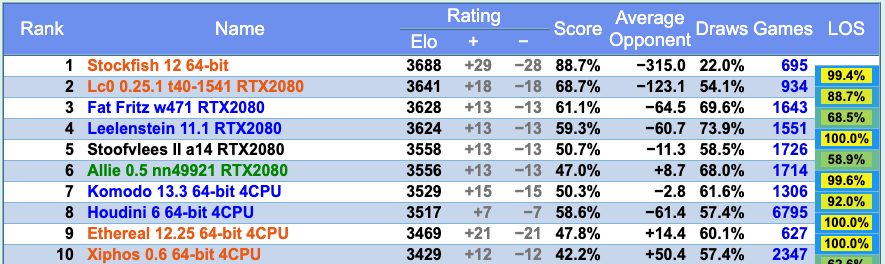

  

<h1 align="center">国际象棋程序Stockfish NNUE设计简介（一）背景简介</h1>

[Stockfish](https://stockfishchess.org/ )是一款开源国际象棋程序。由于最初的开发者中的两位分别来自挪威和意大利，为了纪念两国历史悠久的鳕鱼贸易，开发者将他们的程序命名为了Stockfish。在过去的十多年中，一众爱好者对其不断维护完善，使其成为了棋力最为顶尖的国象程序之一。Stockfish将传统计算机国际象棋技术发挥到了极致，包括但不限于alpha-beta搜索，各种剪枝技术，以及手动调整参数的估值函数等等。至少在2017年之前，Stockfish几乎稳坐各大计算机国象程序棋力排名榜第一名。

然而2017年，Deep Mind发表了关于[Alpha Zero](https://kstatic.googleusercontent.com/files/2f51b2a749a284c2e2dfa13911da965f4855092a179469aedd15fbe4efe8f8cbf9c515ef83ac03a6515fa990e6f85fd827dcd477845e806f23a17845072dc7bd )的论文，并提出：以Monte-Calo Tree Search（MCTS）结合神经网络的方法照样可以达到甚至超越Stockfish现有的棋力。于是2018年，[Leela Chess Zero](https://lczero.org/ )（Lc0）横空出世。另一群爱好者依照Alpha Zero论文中的方法，经过近一年多的开发和参数训练，终于复现了Alpha Zero论文中的结果。截止到2019年底，在[CCRL](https://www.computerchess.org.uk/ccrl/) （Computer Chess Rating List）上，Lc0一度超越Stockfish，成为神经网络时代第一个依靠纯粹的强化学习的方法获得世界顶尖水平的国象程序。

至此，人们不禁会问，在计算机国象领域，是不是传统的基于alpha-beta搜索的方法可以被彻底抛弃了？深度强化学习的时代彻底碾压了一切传统方法？然而事实并不能那么简单的一刀切。Lc0的方法虽然达到了不错的结果，由于使用了无监督（或者说将环境反馈作为监督）策略，其训练的计算代价也是惊人的。有没有办法将利用传统方法中已有的技术来提升机器学习算法的效率？或者能否将传统搜索方法与神经网络相结合，各取所长？能否引入有监督学习以提升训练速度？

一个显而易见的探索方向似乎是人们凭直觉就能想到的：基于alpha-beta搜索的程序需要调用估值函数对当前局面输出一个评估分值，即某一方获胜的概率。它的准确与否直接决定了对搜索的导向是否正确。既然神经网络的表示能力如此强大，为什么不把传统手写的估值函数换成一个神经网络模型，然后利用深度学习方法训练这个模型，来提高估值函数的准确性？

事实上，“将估值函数形式化为一个机器学习模型，并使用机器学习技术去训练它“这件事，很早就有人做了。例如，于上世纪五十年代就被提出的[Temporal Difference Learning](https://www.chessprogramming.org/Temporal_Difference_Learning )，以及1997年由Arthur Samuel，Don Beal和Martin Smith进一步改进的[TD-Leaf(lambda)](https://arxiv.org/pdf/cs/9901001.pdf)，被成功应用到KnightCap和CilkChess两个程序上。然而那个时候的人们并不知道引入非线性模型能够改进模型的表示能力，计算机有限的算力也不支持使用更大规模的训练数据。

2015年，来自帝国理工学院的硕士生Matthew Lai改进了TD-Leaf(lambda)在国象中的训练方法，将原来的线性模型替换为一个简易的三层神经网络，并发布了实验性的国象程序[Giraffe](https://arxiv.org/pdf/1509.01549v1.pdf )。经过大概一周的训练，Giraffe从完全乱下棋水平，进步到了2400ELO（FIDE标准下的“象棋大师”候选人水平），算是非常巨大的进步。不得不说在PyTorch还没有发布的2015年，Matthew为了在训练中使用Torch，要先把网络本身以及一些训练需要用到的函数写成Lua程序，再用Torch自带的C++库将这些Lua程序封装并与自己国象程序的C++代码粘接在一起。可以说Giraffe能取得这样的成绩，Matthew付出的努力可谓“可歌可泣”。然而Giraffe只是在深度学习时代对这一方法的第一步探索，距离挑战世界一流的国象程序还是差的太远了。

至此人们发现，要想在alpha-beta搜索中使用神经网络估值函数，只少需要解决以下三个问题：

1. 如何在保证一定网络复杂性的同时能够快速的计算网络的向前传播？
2. 如果生成足够多样且泛化的训练数据，以及训练数据的标签应该从哪里来？
3. 应该用什么方法训练？

其中问题2、3是所有将现实世界问题形式化为机器学习问题时都会碰到的，而问题1却是这个探索方向所独有的。由于alpha-beta搜索所能达到的最大深度完全取决于单位时间内的搜索速度（即每秒搜索节点数），过慢的搜索速度势必会拉低程序的棋力，因为它会使得程序在单位时间内无法“看的更远”。然而大多数神经网络的向前传播都涉及多步的矩阵加法乘法运算。在CPU上运行这样一个未经优化的程序将会非常耗时。而这一问题是使用神经网络估值函数时所不可回避的。事实上，Giraffe使用神经网络估值时的搜索速度只有使用手写估值函数时的五分之一，这种显著的搜索速度的下降也是限制Giraffe棋力的因素之一。如何在保证网络复杂性的同时又不过多的拖慢搜索速度？这一棘手的取舍问题一直困扰着象棋程序设计者们。

到了2020年5月，事情有了转机。在国象论坛Talkchess出现了一篇关于[Stockfish-NNUE](https://www.chessprogramming.org/Stockfish_NNUE )的帖子，一位ID为[Nodchip](https://www.chessprogramming.org/Hisayori_Noda )的老兄第一次将NNUE技术引入了国象。7月底，Stockfish-NNUE的源码在了[Github](https://github.com/joergoster/Stockfish-NNUE )上正式公布。经过测试与改进，Stockfish-NNUE已经达到甚至超越了使用传统估值函数的Stockfish，并与2020年9月初正式并入Stockfish主分支，成为Stockfish 12的一部分。

NNUE的全名是[Efficiently Updatable Neural Network](https://github.com/ynasu87/nnue/blob/master/docs/nnue.pdf )（可快速更新神经网络），最初由日本将棋程序员[那須悠](https://github.com/ynasu87/nnue/blob/master/docs/nnue.pdf )于2018年提出，并应用于将棋程序中，Nodchip也是这个将棋程序小组中的一员。具体来说，Stockfish-NNUE做出了以下几个贡献：

1. 设计了一种二进制且高维度的棋盘表示，并且在对局或搜索进行时只做增量的更新。不同于之前的神经网络象棋程序，NNUE棋盘表示非常简单，即王所在格子与其他棋子的所在格子的组合。正是由于这一特点使得NNUE的棋盘表示可以增量更新，因为每走一步棋所能影响的棋子或格子都是有限的；
2. 使用了一个浅层（4层）的神经网络作为估值函数模型。网络的所有参数均为整型，并使用英特尔CPU中的高级指令优化矩阵加法和乘法的运算效率；
3. 提出了一种有监督学习的估值函数训练方法，并将两种目标值。一般来说，使用有监督学习训练估值函数，训练数据的目标值一般来自搜索算法使用手写估值函数搜索一定深度后所返回的值。NNUE的训练数据自然也采用了这种目标值，然而除此之外，NNUE还利用了自对弈棋局的最终结果（-1，0，+1对应输、平、赢）作为第二目标值，最后将两种目标加权平均后作为最终目标。加权的权重由参数lambda控制。
4. 设计了一个并行化的数据生成算法，使用原版Stockfish自动且高效的生成训练数据。

毫无疑问，Stockfish-NNUE是继Giraffe之后对“alpha-beta搜索+神经网络估值”这一方法最成功的一次尝试。在上文提到的三个问题中，Stockfish-NNUE都给出了相对不错的答案。这使得使用alpha-beta搜索的程序设计者们又有了一丝新的希望，尤其是在Lc0稳坐第一名近一年之时，NNUE技术的应用使Stockfish再次成为了Lc0“第一名”的挑战者之一。之后我会分几次更具体介绍一下NNUE在Stockfish中的应用。

<!--

  
    <em> CCRL闪电赛排名前十名（截止于2020年9月12日）</em>

  <em> CCRL闪电赛排名前十名（截止于2020年9月12日）</em>
-->

|  |
| :---:       |
| <em>CCRL闪电赛排名前十名（截止于2020年9月12日）</em> |

### References

* [https://github.com/ynasu87/nnue/blob/master/docs/nnue.pdf](https://github.com/ynasu87/nnue/blob/master/docs/nnue.pdf)
* [NNUE - Chessprogramming wiki](https://www.chessprogramming.org/NNUE)
* [Stockfish NNUE - Chessprogramming wiki](https://www.chessprogramming.org/Stockfish_NNUE)