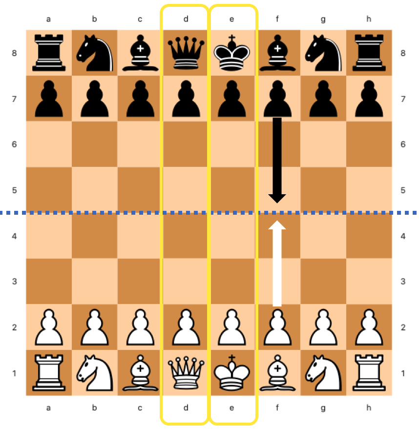
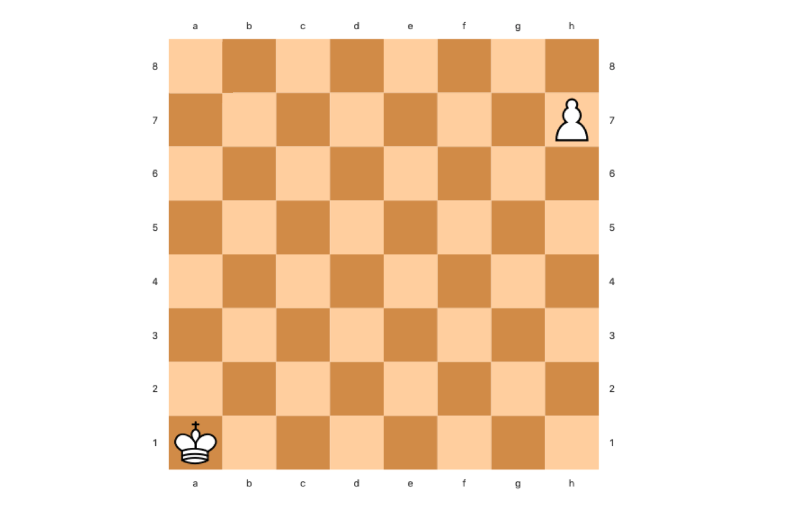
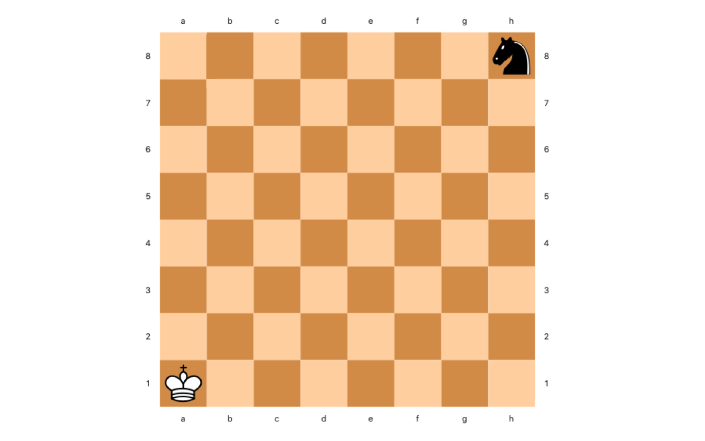
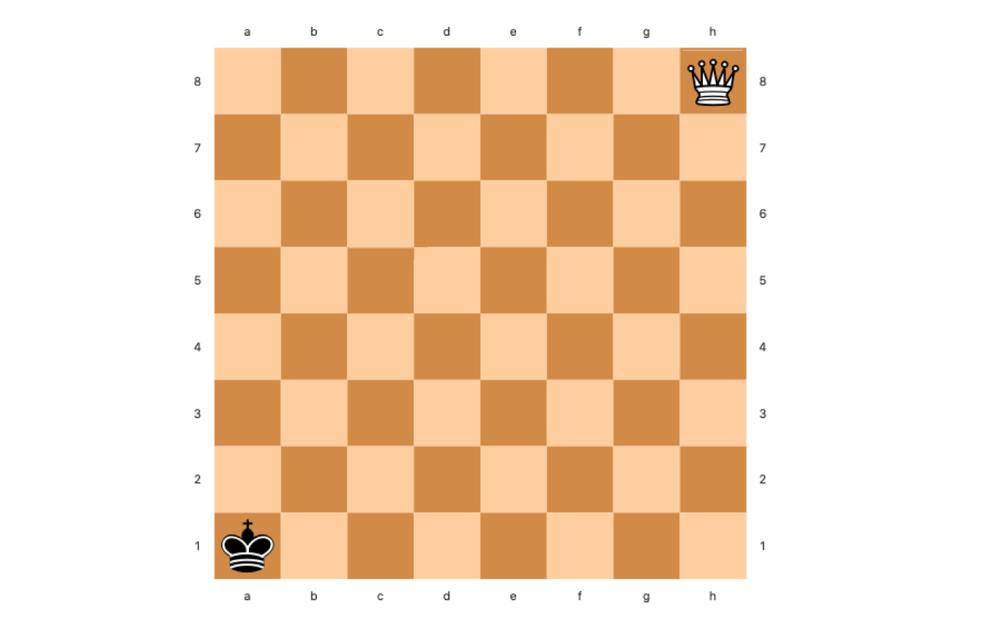
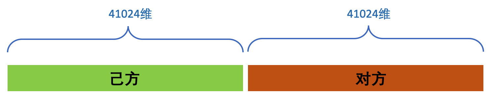

<p align="center">
  
</p>

<h1 align="center">国际象棋程序Stockfish NNUE设计简介（二）棋盘表示</h1>


棋盘表示，即将一个静态的棋盘状态信息量化为一个向量表示，是问题形式化过程中的重要一步。机器学习中也称这个步骤为“特征工程”。这里仅介绍在Stockfish 12中使用的网络结构，也就是HalfKP_256X2_32_32。

NNUE的棋盘表示并未用到任何需要复杂计算的高级信息，仅使用了朴素的棋子与所在格子的组合枚举。作为NNUE估值网络的输入，每一个棋盘局面被表示成为一个41024 x 2 = 82048维的二进制向量。其中41024维是两个棋手中某一方的棋盘表示，而2指棋手双方。注意，这里的x2指的并不是简单的”白方、黑方“，而是指“己方、对方”。


### 己方与对方

那么什么是“己方“与“对方”，以及为什么要这样区分呢？这就要从[Min-Max](https://www.chessprogramming.org/Minimax)搜索本身性质说起。

经典Min-Max搜索规定了，在二人有限零和博弈中，一方为“极大”方，另一方为“极小”方。极大方与极小方轮流相互调用：极大方对每个子节点先调用极小搜索，然后在返回的极小值中选最大的返回；极小方则相反。而估值函数只需返回一个[-1.0，+1.0]之间的概率，以指示当前局面对极大方还是极小方更有利（由符号决定：+表示极大方占优，反之则极小方占优），以及有利的程度（由绝对值决定，越大优势程度越高）。但是稍加观察你就会发现，极小方搜索时做的事情和极大方几乎完全一样，只有符号相反。于是就有了将两方统一起来的[Nega-Max](https://www.chessprogramming.org/Negamax)搜索。
```
int NegaMax(int depth) {
    if (depth == 0) return evaluate(side_to_move);
    int max = -inf;
    for (all_moves) {
        score = -NegaMax(depth - 1);
        if (score > max)
            max = score;
    }
    return max;
}
```
在Nega-Max搜索中，每一方都是极大方。在搜索每个节点时，Nega-Max将子节点的搜索返回的估值符号翻转，这样子节点原本的极大值到了本层就变成极小值。此外，估值也将被视为一次0层的Nega-Max搜索——估值函数并不需要去搜索（因为需要搜索的层数是0），但符号翻转仍是必须的。也就是说，估值函数要假设当前走棋一方为极大方来输出估值。这个“当前走棋一方”，就是“己方“。

在大多数使用传统方法的国象程序中，这个估值函数的符号翻转是如下实现的：

1. 首先对双方的局面形势各自打分，这个分数是非负数
2. 将“己方”分数减去“对方”分数的差作为估值返回

而NNUE的估值函数，只是将最后一步的减法内化到网络计算当中去了。


### 黑方为“己方”时的棋盘翻转

既然黑白双方都有可能做“己方”，那么对黑白方的表示就应当是完全对称的：即，如果将棋盘上的棋子颜色互换，行棋方也翻转，那么计算出的棋盘表示应该和原来局面的表示是完全一样的。对于国象而言，为了达到这一目的，一些特殊处理仍是必要的。不同于五子棋或围棋，象棋中某些走法是上下不对称的。比如兵的走法，白方是从2行向8行推进，而黑方正好相反，从7行向1行推进。假如我们把棋盘上的格子按A1到H8分别按0到63编号的话，那么在8号格子（A2）上的黑兵和白兵的意义是完全不同的：黑兵只差一步就可以升变了，对白方有巨大威胁，而这个位置的白兵则恐怕还没出家门。

|  |
| :---:       |
| <em>国象棋盘的起始局面。注意黄框中的后和王，王均在右侧，后均在左侧，无论黑白。因此国象棋盘并不左右对称。</em> |

为了解决这个问题，NNUE在表示黑方的棋子位置时，将他们的标号做了上下左右两次镜面翻转（注，针对这种翻转方法，包括我在内的很多人都有异议。实际上对国象而言，仅做上下翻转是更恰当的，因为国象的双方的棋子排布是上下轴对称的，而不是中心对称。国象的左右两侧并不对称：黑白王都在H一侧，后都在A一侧。Nodchip也曾在Discord频道中承认这种翻转方法只是照搬了将棋的做法而没有考虑国象的特殊情况，属于一个疏忽。更多的讨论详见[Github issue](https://github.com/official-stockfish/Stockfish/issues/3021)）。于是对于黑方，H8成了0号格子，A1成了63号格子。“位于8号格子的己方的兵”的意义对黑方或白方便不再有区别。我们不必再担心黑方白方，只要关注于“己方”还是“对方”就可以了。这种位置表示上的统一，对之后的训练数据生成，以及参数训练都带来了便利。


### 单方棋盘表示

那么41024维又是怎么计算的呢？

简单来说，这41024维向量表示的是：己方的“王的格子”与所有“除对方王之外的棋子所在格子”的组合。这里41024 = 64 *（2 * 5 * 64 + 1），其中64是己方的王所在格子的枚举个数，（2 * 5 * 64 + 1）是除对方王之外的棋子所在格子的枚举个数。

* **己方的王所在格子** 己方的王只有一个，其所在格子有64个，所以是1 x 64 = 64。
* **除对方王之外的棋子所在格子** 双方除王之外总共有[黑、白] x [兵、马、象、车、后]共10种棋子，每个棋子可能位于64个格子，于是有2 * 5 * 64 = 640。而最后的+1据说是表示上个着法是否为吃子着法，然而在国象中的用途并不明确。我个人认为这只是NNUE从将棋移植到国象过程中的遗留，在国象里并没有使用。

最后，将以上两种状态组合，总共可以得到64 x 641 = 41024种组合。这种组合本质上反映了某一方的王与棋盘上每一个其他子力的位置关系。下文中我会将统一称这样一个状态组合为一个“位置关系”。每种子力位置关系都被赋予一个枚举值。NNUE为每个枚举值都计算了一个编号，具体计算方法如下：

**定义棋子种类编号：**

* 己方兵 = 0，对方兵 = 1
* 己方马 = 2，对方马 = 3
* 己方象 = 4，对方象 = 5
* 己方车 = 6，对方车 = 7
* 己方后 = 8，对方后 = 9

**定义格子编号：**

* 白方为己方时：A1 ～ H8 = [0 ... 63]
* 黑方为己方时：A1 ～ H8 = [63 ... 0]

于是有：位置关系枚举值 = 己方王格子编号 * 641 + 棋子种类编号 * 64 + 棋子格子编号 + 1

**例 1**：白王在A1并且白兵在H7



* 己方为白方，白兵为己方兵，故白兵棋子编号 = 0
* 白王格子编号 = 0，白兵格子编号 = 55
* 位置关系枚举值 = 0 * 641 + 0 * 64 + 55 + 1 = 56

**例 2**：白王在A1并且黑马在H8



* 己方为白方，黑马为对方马，故黑马棋子编号 = 3
* 白王格子编号 = 0，黑马格子编号 = 63
* 位置关系枚举值 = 0 * 641 + 3 * 64 + 63 + 1 = 256

**例 3**：黑王在A1并且白后在H8



* 己方为黑方，白后为对方后，故白后棋子编号 = 9
* 由于己方为黑方，因此要翻转棋盘。翻转后，黑王格子编号 = 63，白后格子编号 = 0
* 位置关系枚举值 = 63 * 641 + 9 * 64 + 0 + 1 = 40960


### 枚举值二进制化

某一方的棋盘表示就是所有出现在当前棋盘上的如上文提到的位置关系组成的集合。一个棋盘状态显然包含了不只一个位置关系，国象棋盘上除王之外最多会有三十个棋子。显然，简单的把所有枚举值放到一个向量中是一种并不明智的策略。我们需要将这个集合中的枚举值二进制化。

二进制化是特征工程非常常见的技术，其根本目的是增加一些枚举值特征的线性可分性，尤其是当枚举值参与模型计算时。简单来说，就是用一个维度等于枚举值所有可能取值个数的向量来表示一个枚举变量的取值，每个维度或者下标对应一个枚举值。向量初始值全是0，只有当前取值所对应下标上的元素被置为1。这其实就是分类问题中常用的“独热编码”（one-hot encoding）。在NNUE中，类似的，我们用一个41024维的二进制向量来表示棋盘状态，并把棋盘中出现的位置关系所对应的下标上的元素被置为1，除此之外全置0。由于棋盘表示是一个位置关系的集合，因此不是只有一个1，而是每个集合中出现的位置关系枚举值的下标都被置为1。

对于NNUE来说，这样做还有额外的好处。可以想像，尽管这个向量维度高达四万多维，实际上却是非常稀疏的。因为棋盘上的棋子做多只会有三十二个，且每个维度上不是0就是1。因此，NNUE可以按照二进制稀疏向量的方法存储：即只记录所有非零的向量下标。这会大大节省存储和维护开销。更关键的是，每走一步所能影响的棋子和格子非常少，因此这个稀疏向量还可以随着着法的执行和撤销增量的更新，这近一步加快了棋盘表示的计算速度。正如在上一篇中提到的，这一点是NNUE的创新之一，对于程序发挥更强的棋力至关重要。

以上便是NNUE单方棋盘表示向量的计算方法。对于对弈双方，NNUE首先计算己方的表示向量，再计算对方的向量。最后将两方的棋盘表示向量按己方、对方的顺序拼接为一个82048维的完整表示[^1]。




### 总结

为了加快棋盘表示的计算速度，NNUE大胆的使用了朴素但高维度的二进制化的向量作为网络的输入特征。这使得增量化的计算和维护棋盘表示成为可能，也是为什么NNUE能够比前几代神经网络估值的程序更快的原因之一。使用相对简单直接的棋盘表示也是对深度学习中“端到端学习”思想的实践：不应把过多的精力放到复杂的特征工程中，而应该将这项任务融合到模型本身当中去。


### 参考

[^1]: 这里只是为了描述方便。实际上NNUE并没有立马拼接出这个82048维的向量，而是将双方各自的41024维向量直接用来计算出了网络第一层的输出。每一方输出是256维，之后这两个向量才“拼接”成了一个512维的向量作为下一层的输入。
