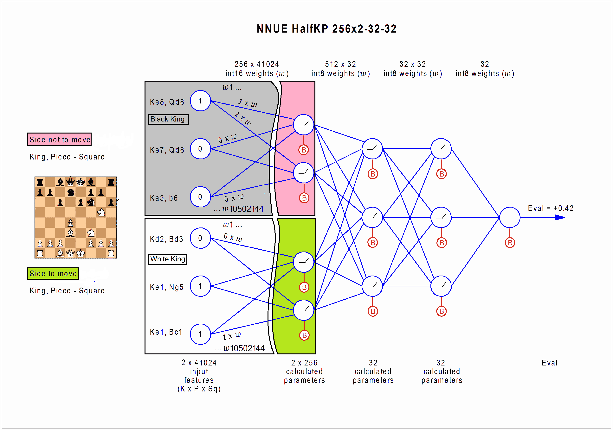
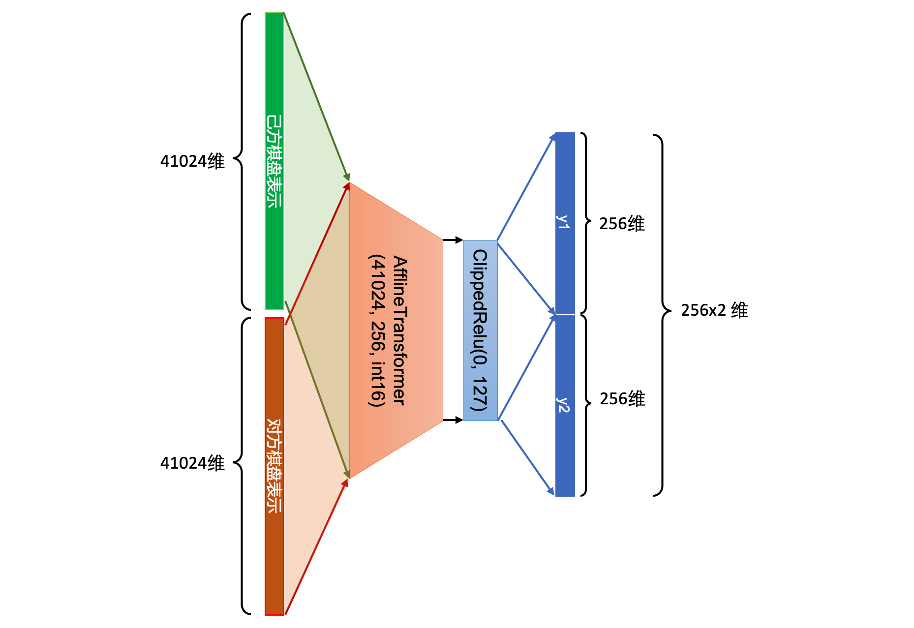
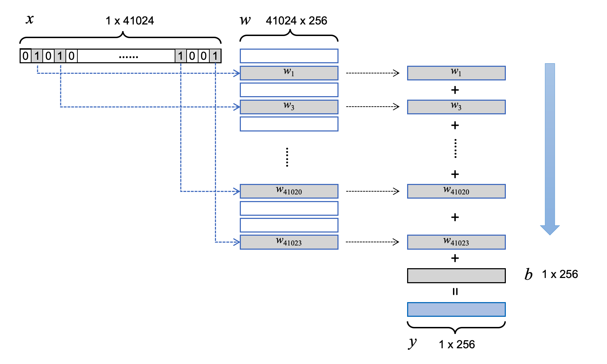
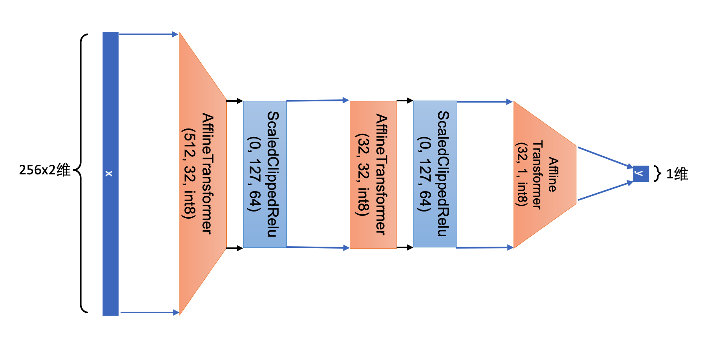
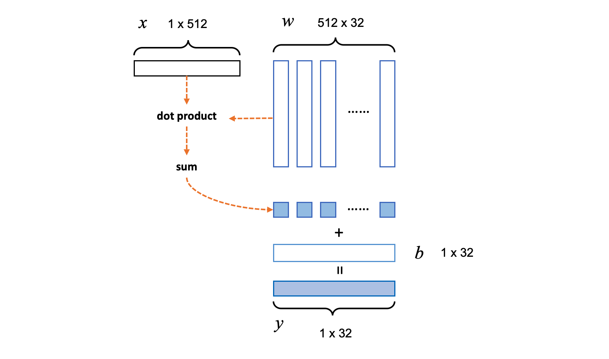
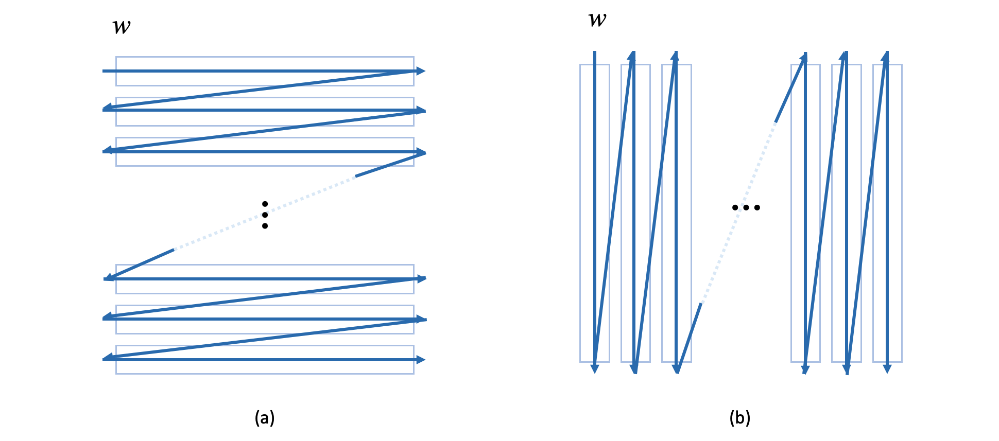

<p align="center">
  
</p>

<h1 align="center">国际象棋程序Stockfish NNUE设计简介（三）网络结构</h1>

由于要限制向前传播的计算时间，NNUE的网络结构并不复杂，是典型的全连接神经网络，总共只有四层。其中第一层（输入层）参数数量非常巨大，后三层则相对较小，呈现“头大身子小”的形状。下面的图是Nodchip制作的关于HalfKP_256X2_32_32的网络结构图。

|  |
| :---: |
| <em>Nodchip制作的HalfKP_256X2_32_32网络结构示意图</em> |


其中最左侧棋盘表示部分光看图的话有些不好理解。借用上一篇提到的概念，"active"指己方，"opponent"指对方。"King, Piece - Squares"其实是King Square - Piece Square，也就是“王所在格子”和“其他棋子所在格子”的组合。我在上一篇中将此组合定义为了“位置关系”。图上剩下的部分就是网络结构。 在正式的介绍网络结构之前，先介绍一下NNUE网络中用到的各种子结构，相当于PyTorch中的nn.Module。

**AfflineTransformer Layer:** 也就是PyTorch里的nn.Linear，就是最简单的$y=wx+b$。AfflineTransformer(x, dinput, doutput, type)表示该层的输入为x，输入维度为dinput，输出维度为doutput，以及参数类型是type。

**ClippedReLu Layer:** 不同于原版ReLu，ClippedReLu不但有下界，还有一个上界。所有小于下届（lowerbound）或大于上界的（upperbound）的输入都会分别被替换为下界或上界。

```
 ClippedReLu(x, lowerbound, upperbound) = max(lowerbound, min(x, upperbound))
```

在NNUE的实现中，lowerbound = 0， upperbound = 127（int8的最大正数取值）。NNUE网络使用ClippedRelu是因为NNUE网络的参数和计算结果均以整型存储，而C/C++中，整型的上溢或下溢都是不会报错的。而127的上界又很容易越过，任何大于整型上界的变量值在赋给8位整形变量时，经过类型强制转换后会得到难以预料的非法数值。为了防止这些数值的出现，ClippedReLu 直接超过上界的输入“裁剪”为上界。

**ScaledClippedReLu Layer:** ScaledClippedReLu比一般的ClippedReLu多了一步“放缩”，即将输入除以一个分母，先将其缩小数倍，再输入到ClippedReLu得到输出。

```
ScaledClippedReLu(x, lowerbound, upperbound, denominator) 
    = ClippedReLu(x / denominator, lowerbound, upperbound)
```
其中denominator是缩小的倍数。使用放缩是因为NNUE的网络的计算结果要以8位整型存储，正数上界为127。而经过矩阵法乘法加法运算后，每个维度的输出范围的上界会比127大得多。如果不进行放缩，很多超过127的输出无论多大都会被裁剪为127，这就使得原本大小有区别的输出变得没有了区别，损失了很多信息。经过放缩之后信息就得到了一定程度的保留，尽管粒度变得更粗糙了。在实际应用中，denominator = 64，并且除法是通过向右位移6位实现的。

实际上，包括“裁剪”、“防缩”在内的这些额外处理大都是由使用整型参数引起的。而使用整型参数的目就是为了利用CPU中的高级指令来并行化的实现小规模的向量乘法与加法。我会在后文中解释具体的做法。

按照NNUE的实现，这个网络可以分成两部分：第一层被又被称作FeatureTransformer，剩余的部分被称为Network。


### FeatureTransformer部分

用上文提到的层来描述的话，FeatureTransformer的结构如下：

AfflineTransformer(x, 41024, 256, int16) -> ClippedReLu(x, 0, 127)

以上的变换只考虑了己方或对方当中的某一方。实际上双方的棋盘表示都需要经过此变换。因此对任意一个己方和对方的棋盘表示分别为x1和x2的局面，FeatureTransformer中的变换严格来说是如下进行的：

* AfflineTransformer(x1, 41024, 256, int16) -> ClippedReLu(x1', 0, 127) -> y1
* AfflineTransformer(x2, 41024, 256, int16) -> ClippedReLu(x2', 0, 127) -> y2
* y = y1 $\oplus$ y2

注意以上计算y1和y2用到的参数是一样的，只是输入有两个，因此输出也是两个：y1与y2，各自256维。按顺序拼接在一起后，就得到512维的输出y。


|  |
| :---: |
| <em>FeatureTransformer部分网络结构示意图</em> |

以上的层只是为了准确的描述。实际上第一层的输出并不是在估值时才通过调用向前传播来计算，而是也和棋盘表示一起随着棋局着法执行和撤销增量进行的。NNUE将第一层单独拿出来也是为便于进行这种增量计算。

如上篇所述，某一方的棋盘表示x是一个二进制的稀疏向量，其非零元素下标集合为$\{i_1, i_2, ..., i_k\}$。我们假设x是一个41024维的横向量，那么对应的，AfflineTransformer 中的b也是一个256维的横向量，w的形状为41024 x 256。我们可以把w的每一行看作一个向量，于是w可以表示为41024个256维的行向量组成的向量数组， 第$i$行向量用$w_i$表示。那么，wx+b就可以简化为一串向量累加运算：$wx+b = \sum^k_{j}w_{i_j} + b$。这一过程和我们在NLP中使用word embedding矩阵计算一个句子（假设句子encoding是由其包含的所有不重复词的one hot encoding相加得来的）的embedding的过程极为相似。

|  |
| :---: |
| <em>稀疏二进制向量x与w做乘法可以简化为挑选w中x的非零元素所对应的行的和。类比NLP中的例子，如果忽略b，并假设x是一个词的one hot encoding，那么这个过程就是在计算x的wording embedding</em> |

随着对局的进行，x非零元素下标集合也在增量的改变，对应的以上累加结果也可增量的改变。可以设想一下，如果每个$w_i$是一个数字的话，这个累加的更新过程就变的极其简单快速了：只要减掉从集合中消失了的下标对应的$w_i$，再加上新出现的$w_j$就可以了。其实换成向量，过程也类似，只是数字的加减变成了若干256维的整型向量的加减法。如果向量的加减也能像数字加减一样，那一次向前传播的计算速度就会大大加快。而这正是NNUE使用整型参数的最终目的：利用高级CPU指令实现快速向量加减法。实际实验证明，即使仅使用SSE4.2指令集的CPU上，Stockfish-NNUE的搜索速度也比用使用for循环实现向量加减法的版本快了近一倍，这将对棋力产生重大影响。而使用最新的AVX2或AVX512指令集的Stockfish-NNUE将会更快。


### Network部分

严格来说，Network在代码中并不是一个类。NNUE将多层的全连接网络存成了一个链表，链表中每个元素是一层。每层只记录自己的上一层，且都有自己向前传播函数。每一层在计算向前传播时，首先计算上一层的向前传播，并将其输出作为本层输入，再计算自己的输出。于是，当调用链表尾端最后一层的向前传播，通过层层递归，就相当于计算了整个网络的向前传播。NNUE其实只是把最后一层“重命名”为了Network。用上文提到的层来描述的话，Network部分的结构如下：

AfflineTransformer(x, 512, 32, int8) -> ScaledClippedReLu(x, 0, 127, 64) -> AfflineTransformer(x, 32, 32, int8) -> ScaledClippedReLu(x, 0, 127, 64) -> AfflineTransformer(x, 32, 1, int8)

|  |
| :---: |
| <em>Network部分网络结构示意图</em> |

与FeatureTransformer类似，Network部分中的矩阵乘法也可以通过快速向量操作来实现。不过这里的输入向量不再是二进制稀疏向量，因此需要实打实的计算输入行向量与w的列向量的点积，再求和。其中点积的部分也可以通过CPU指令优化。好在这部分的网络规模远远小于输入层，做密集矩阵的计算也不会额外耗时太多。




### 网络输出与最终估值输出

注意上面的网络的最后一层是没有activation的，而是直接把最后的线性变换的结果输出了，因此这个输出的范围比activation的输出范围要大的多。在不考虑bias的情况下，最后一层输出的可以在区间 [-127 x 128 x 32, 127 x 127 x 32]。加上bias之后值域会有偏移，但范围的大小不变。 然而这个范围相对于Stockfish的估值还是太大了。Stockfish的手写估值函数返回值是一个16位整型值，范围 [-32000, +32000] （Stockfish将绝对值超过这个范围一些值用作了特殊值，比如“非法”、“困毙”、“在n步内困毙”）。为了将网络的输出映射到Stockfish的传统估值范围，NNUE将网络输出做了最后一步变换：

y = clip((x / 16), -32000, 32000)

其中，clip函数类似ClippedRelu层的变换，将超出上界或下界的输入值替换为上界或下界。从上一部分的描述可以看到，Network最后一层输出范围是127*127*32 - (-127*128*32) = 1036320，恰好是一个20位整型变量的取值范围。除以16相当于右移4位，结果正好是一个16位整数，范围[-32768，+32767]。裁剪掉绝对值超过32000的部分，就得到了一个合法的Stockfish局面估值。

为了避免语言描述的不准确，我用Pytorch实现了一下以上描述的NNUE网络（不包含最终估值输出的变换），代码详见[Github](https://github.com/nkg114mc/sfnnue-intro/blob/master/pytorch-nnue-net.py)。


---


下面的内容是关于NNUE网络及其向前传播的具体实现，属于源代码的细节，如果只是对NNUE理论感兴趣的童鞋可以直接忽略。

### nn.bin文件结构

Stockfish的测试系统FishTest专门创建了一个页面[NN stats](https://tests.stockfishchess.org/nns)，用于用户上传他们训练出来的权重。如果你曾经从上面的网页下载过权重，就会注意到这个二进制文件有大约21MB。这里就简单介绍一下这个文件的结构。nn.bin文件按照字节流的顺序，存储了以下信息：

#### Header部分

* **version**: uint32，4字节。版本信息，为将来升级而预留的信息。
* **hashvalue**: uint32，4字节。Header的hashvalue是FeatureTransformer和Network部分各自的hashvalue异或之后的结果。
* **arch_name_size**: uint32，4字节。arch_name是一个以字节流存储的字符串，包含两部分：长度和内容。这里首先是4字节的长度信息，表示这个字符串包含的字符个数。每个字符一字节。
* **arch_name_string**: char[]，<arch_name_size>字节。就是字符串的内容。例如，HalfKP_256X2_32_32结构会输出如下内容，其实就是一个人类可读的网络结构描述。

```
Features=HalfKP(Friend)[41024->256x2],Network=AffineTransform[1<-32](ClippedReLU[32](AffineTransform[32<-32](ClippedReLU[32](AffineTransform[32<-512](InputSlice[512(0:512)])))))
```

#### FeatureTransformer部分

* **hashvalue**: uint32，4字节。hashvalue是由输入维度，输出维度等重要参数为输入计算出的32位哈希值，以保证读入权重的网络结构与Stockfish-NNUE正在使用的网络结构是一致的。
* **bias**: int16[]，256 * 2字节。存储输入层的b向量。
* **weights**: int16[]，41024 * 256 * 2字节。存储输入层的w矩阵。w本来是一个二维数组，这里NNUE将它拉平成为了一个一维数组。拉平的方法是先行后列，也就是保证行向量元素的存储空间依旧连续。

#### Network部分

* **hashvalue**: uint32，4字节。与FeatureTransformer的hashvalue类似。这里的hashvalue是之后三层各自计算出的hashvalue异或在一起之后的结果。
* **bias**: int8，32 * 1字节。存储第二层的b向量。
* **weights**: int8[]，512 * 32 * 1字节。存储第二层的w矩阵。注意这里的w的拉平方法与FeatureTransformer正好相反，是先列后行，保证每个列向量元素的存储空间依旧连续。
* **bias**: int8[]，32 * 1字节。存储第三层的b向量。
* **weights**: int8，32 * 32 * 1字节。存储第三层的w矩阵，先列后行。
* **bias**: int8[]，1 * 1字节。存储第四层的b向量。
* **weights**: int8[]，32 * 1 * 1字节。存储第四层的w矩阵，先列后行。

注意，两部分对w的存储有所不同：FeatureTransformer中的w是按照行向量优先存储的，而其他层的w则是按照列向量优先存储。初次遇到这种不一致可能会很费解，然而如果搞明白了NNUE是如何做矩阵乘法的，就不难理解了。因为在FeatureTransformer部分，矩阵乘法计算主要以w部分的行向量相加来进行，因此保证行向量优先便于成块的读取内存中w的行向量来作为CPU向量指令的操作数。相反，在Network部分，矩阵乘法则要先计算输入向量与w列向量的点积，因此需要成块读取的操作数就变成了列向量。这一切都是为了CPU的向量指令能够方便的从内存中读取操作数而设计的。

|  |
| :---: |
| <em>w矩阵拉平方法：(a)为FeatureTransformer使用的“先行后列”，(b)为其他部分使用的“先列后行”</em> |


### 使用CPU SIMD指令的快速整数向量操作

如上文所述，我们希望能够像计算两个数字相加一样快速的计算两个向量的相加。以FeatureTransformer中的w为例：每一个行向量  是一个长度为256类型为int16的数组。如果用最一般的C语言实现这个加法，那么只能是通过for循环对每个数组元素做256次加法。这个过程有256次操作，显然会比较慢。如果存在一个指令，仅通过一个操作就能实现这个数组的加法，那无疑是最完美的。

走运的是，CPU中存在一些高级指令能够允许用户能实现一定限度的数据层面的并行化。这种技术又被称为单指令流多数据流（SIMD）。例如在英特尔CPU中的AVX2指令集，就允许对两个256位的向量（相当于C/C++中的数组，就是32字节的连续内存块）直接进行一些二元操作。用户可以定义向量中每个元素占用的字节数。例如，我可以把这256位的向量看作长度为32的int8向量，也可以是长度为16的int16向量等等。最大的类型可以到int64。两个向量的加法可以通过专用的函数_mm256_add_epi16来完成。此外还可以进行减法，乘法，赋值，归零等等操作。

回到最开始FeatureTransformer的例子，每个  是256 x 2 = 512字节（int16是2字节）的向量。在AVX2指令集中，一次可以计算256位也就是32字节的向量的加法。那么两个  的加法只需要for循环16次这样的操作就可以完成了。相比于最原始的for循环，我们的操作个数只有原来的1/16，速度大大加快。类似的SSE3指令集也允许这种向量操作，只不过它的最大带宽只有128位或是16字节。

其实，以上的操作在GPU计算中非常常见，而且规模要大得多。NNUE的作者使用SIMD指令做整数向量操作，某种意义上可以视为使用了“集成在CPU中的微型GPU”来实现了向量运算。我个人并不清楚作者这样做的明确目的。猜测大概是为了避免对GPU的硬件依赖，毕竟不是每台计算设备都配备有高性能的GPU。


### 补充：关于NNUE不使用GPU的原因

感谢 @恨铁不成钢琴 的补充。关于NNUE不使用GPU的原因，我觉的他说的更有道理：

> SIMD的用法是减少计算延迟用的。在剪枝的时候，剪枝算法的batch_size并不会太大（传统剪枝的batch_size其实是1，因为每次只针对一个局面判断是否剪枝）。如果此时使用GPU，会带来很大的延迟（传数据去GPU，剪枝，再传回来，延迟并不可以忽略）。现在鳕鱼干NNUE搜索的速度大约是每秒几千万个节点，GPU很难在每秒处理几千万个节点，如果真的用神经网络，只要是块nvidia的显卡计算速度都比（同时代）cpu快10倍左右——但考虑到通信成本，我们并不能完美利用GPU的计算速度。

由于alpha-beta搜索的序列性（即子节点要按顺序搜索，因为不知道哪个会发生beta剪枝），NNUE的向前传播需要在batch_size为1的条件下进行。CPU和GPU通信是有延迟的。当batch_size较大时，GPU带来的加速完全可以抵消这种延迟。然而当batch_size = 1时，延迟的成本完全盖过了GPU加速的收益，得不偿失。