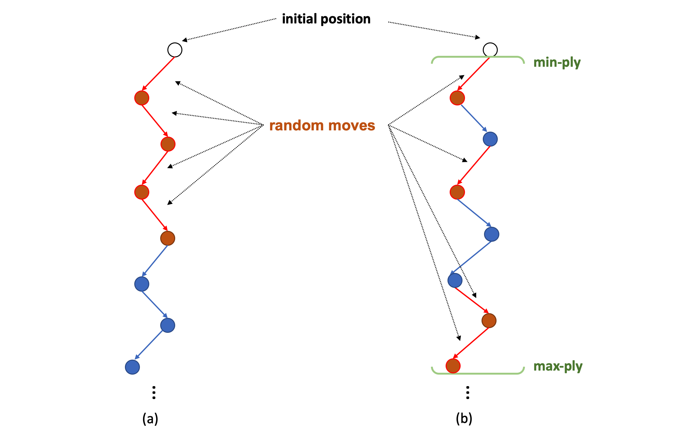
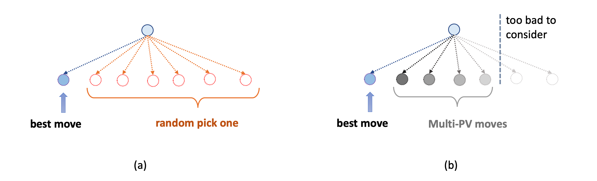
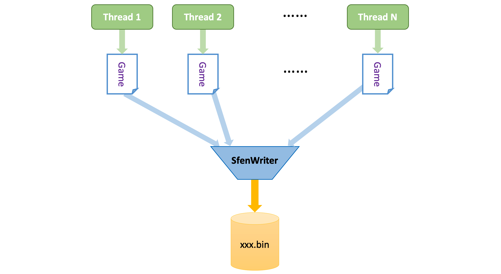

<p align="center">
  
</p>

<h1 align="center">国际象棋程序Stockfish NNUE设计简介（四）训练数据生成</h1>


前三篇主要介绍了在给定一个训练好的权重的前提下，Stockfish NNUE是如何使用它的。接下来的两篇我们会着重介绍一下如何训练一个NNUE网络的权重。

训练一个NNUE网络权重一般要经过两步：一，生成训练数据；二使用训练数据训练网络。如果你曾经编译过Stockfish NNUE，或者尝试训练NNUE权重的话，你就会知道，Stockfish NNUE从训练到实际应用，包含了三个可执行文件，分别对应三种不同的功能：

* **nnue**：使用了NNUE网络的Stockfish，用图形界面加载他就可以下棋了。
* **nnue-gen-sfen**：NNUE训练数据生成器。
* **nnue-learn**：NNUE网络权重训练器。

这其中，第二个可执行文件就是用来生成训练数据文件的（末尾我会简要介绍如何从源码编译得到这几个可执行文件）。本篇就着重介绍一下NNUE训练数据的生成方法。

### PackedSfenValue结构体

NNUE的训练数据存储在一个二进制文件中。与所有有监督学习数据集类似，文件的内容就是一个巨大的训练样本序列。其中，每一个样本包含输入（已经提取特征了的feature vector或未经处理的原始数据）和标签。在NNUE的代码中，每个训练样本被称为PackedSfenValue。PackedSfenValue是一个40字节的结构体，包含了经过压缩的棋盘局面、胜负，搜索depth层返回的估值，搜索depth层返回的move，以及步数gamePly。每当我们跑一次NNUE的训练数据生成，就会生成这样一个xxx.bin的文件。由于此文件是由若干PackedSfenValue的字节块组成，因此它的大小一定是40字节的整数倍。例如，生成一个包含1000000样本（棋盘局面）的文件，其大小一定是40MB。

下面详细介绍一下PackedSfenValue结构体。PackedSfenValue包含了以下六个成员：

* **PackedSfen**：int8[32]，这是已经经过压缩的棋盘局面的[fen字符串](https://www.chessprogramming.org/Forsyth-Edwards_Notation)。fen是国象中常用的表示棋盘局面的字符串格式。然而原始fen字符串长度不定，且有很多允余信息。NNUE将其压缩为了32字节的紧凑格式。
* **score**：int16，从当前局面出发，使用Stockfish搜索depth层返回的估值。这里Stockfish执行alpha-beta搜索时使用的是Stockfish原版手写的估值函数（NNUE也提供了使用已训练好的NNUE网络来搜索的编译选项，但最后并没有使用）。一般来说，从当前局面经过depth层alpha-beta搜索时所返回的估值，要比直接调用估值函数评估当前局面的值相对来说更准确，且depth越大准确度越高。这是因为alpha-beta搜索对当前局面的动态分支都进行了探索，而手写的估值函数则往往只对局面的静态特征有较好的描述。（跑个题，这个获得score的过程其实正反映了我们对估值函数的期望：对当前局面的估值能够尽可能准确的反映搜索N层之后棋局的发展趋势，且N越大越好。可以想象一种极端完美的情况：估值函数的返回值与搜索到棋局结束之后的返回值相同——这个时候我们就不需要搜索了，直接用估值函数挑选最好的子节点返回就完事了。当然实际要做到这一点是几乎不可能的）
* **move**：uint16，上面提到的搜索返回score同时返回的对应的最佳着法。alpha-beta搜索不但能返回最佳子节点的值，还能顺便返回最佳子节点对应的着法，类似Dijkstra算法不但能返回最短路长度，还能返回最短路径本身。不过move并不参与训练，只用于评估。在训练过程中，每隔几个epoch，训练算法就会在校验集上应用刚训练好的NNUE网络，通过alpha-beta搜索得到一个最佳着法，然后比对该着法与move是否一致，并计在最后计算在整校验集中一致的样本占整个校验集的百分比。在训练的早期，NNUE网络的权重还很不靠谱时，这个百分比能一定程度的反映训练的进度。
* **gamePly**：uint16，对局步数，也就是当前对局已经到了第几步。
* **game_result**：int8，对局结果，1表示“己方”最终获胜，-1表示“对方”最终获胜，0表示和起。“己方”的定义与第二篇介绍的一样，就是当前走棋的一方。
* **padding**：uint8，补充字节，目前未使用。

单从PackedSfenValue的内容，我们依旧能够看到一些NNUE训练数据的特点。其中最重要的一点就是，NNUE的训练样本中的每个棋盘局面都来自一个从国象初始局面开始的完整对局，因此才会包含gamePly和game_result这两项。尤其是game_result的加入，使得NNUE学习阶段的目标不单纯的依赖于score，而是一个score与game_result的线性组合，有点类似于短期目标和长期目标的结合。想象一下，如果NNUE的训练阶段完全依赖于score，而score又是Stockfish通过手写估值函数搜索得到的值，那么最终无非会出现两种情况：

1. 如果这个手写函数的估值不准确，那么NNUE的训练就会被它误导，结果恐怕不会太好；
1. 如果这个手写函数的估值非常准确，那NNUE的训练成果到底该归功于训练本身，还是这个手写函数提供的高质量数据？而且既然已经有了这么准确的手写估值函数，干嘛还要再训练一个NNUE网络呢？

显然，无论那种情况都会导致NNUE的训练结果严重依赖于手写估值函数的质量，这就产生了一个“先有鸡还是先有蛋”的问题。game_result的加入虽然未能彻底解决训练过程对手写估值函数的依赖，但一定程度的校正了手写估值函数自身缺陷对训练的负面影响[^1]。


### 生成算法

NNUE的训练数据生成是以自对弈为基本单位进行的。整个生成算法包含了两层循环。外循环是关于生成、存储棋局的，内循环则是每个自对弈棋局的每一步。以下是伪代码：
```
while (finished < loop) {
	// store last finished game
	storeGame(game, game_result);
	finished += ply;

	// initialize new game
	game = [];
	game_result = UNKNOWN;
	position = initialPosition;

	// start self-play
	for (ply = 0; ply < maxPly; ply++) {
		if (position.isGameOver()) { // game is over
			game_result = position.gameResult();
			break;
		}
		if (score >= eval_limit) { // score has exceeded eval_limit
			break;
		}
		if (position.legalMoveNumber() == 0){ // no legal moves available, draw
			break;
		}

		// run alpha-beta search for the best move and score
		score, move = search(position, depth, nodes);

		// temporarily store the new sample to game
		game[ply] = (position.PackedSfen(), score, move, ply);

		// execute self-play move
		position.makeMove(move);
	}
}
```
其中，search部分就是上文提到的固定层数的alpha-beta搜索。每次搜索之后就会得到score和move，加上无需搜索就有的PackedSfen和gamePly，就得到了一个PackedSfenValue结构体的大部分值，而game_result要等每个对局结束之后才加入。简单来说，生成数据的过程其实就是使用原版（不用NNUE的版本）Stockfish不停的跑自对弈的过程。

至此，我们可以简要对比NNUE与Giraffe在生成训练数据方法上的区别。Giraffe的训练数据有几点重要的不同：

1. Giraffe的训练数据是线上生成的。也就是说，Giraffe不存在专门的生成训练数据文件这一步，而是每个mini-batch的权重更新之前，现场生成训练数据并存与内存中。而NNUE使用的线下生成数据：训练开始的时候，直接从磁盘成块的读取训练数据就行了。
1. Giraffe样本中的label要简单的多，只有一个棋盘表示和搜索之后的PV line和PV上每个着法对应的score。而NNUE的label则包含了除局面信息之外的四项内容。
1. 也是由于（2）的原因，Giraffe的局面虽然也是来源于自对弈，但是它的起始局面并不是从国象的起始局面开始的，而是从一个巨大的真实对局库中随机sample出来一个局面，并在这个局面的基础上先随机走一步，然后再才开始自对弈的。从这里我们也可以看到，由于训练算法的不同，Giraffe并不在乎自对弈的最终结果，而更在乎自对弈的着法序列本身，毕竟那才是是TD-Leaf(lambda)的输入。


以下简单介绍一下生成算法用到一些参数。你可以在用命令行启动可执行文件时设置这些参数。

首先是一些系统参数：

* **thread_num**, int：总共要用到的线程数。NNUE的生成程序支持并行化，因此可用的线程越多速度越快。注意这个参数是Stockfish自带的UCI选项，而不是NNUE的命令行参数。设置该参数的方法，与设置Stockfish采用多少个线程做并行化搜索时的方法一致，需要使用UCI协议中的option命令。关于什么是[UCI协议，可参考这里](https://www.chessprogramming.org/UCI)。
* **output_file_name**, string：输出文件名。默认文件名是“generated_kifu.bin”。
* **random_file_name**, bool：是否使用随机文件名。设为true生成程序会在文件名后面追加一个128位的随机整数，这样就不用担心每次运行时把已有的老的生成文件给覆盖掉。默认为false。
* **save_every**, int：是否将生成数据按每x个输出为一个不同的文件，该参数值即为x。例如，总共输出10000样本，save_every = 1000，那么最终会得到10个文件，每个文件1000样本。默认为64位整数的最大值，也就相当于“无穷大”，等于默认只生成一个文件。

以下是关于生成算法本身的一些参数：

* **loop**, int：总共要生成的样本个数，或者棋盘局面个数。注意此参数并不是指对局个数。例如，我们设置loop = 10000，他可以由100局对局组成，其中每个对局100步，也可以是500个对局，其中每个对局20步。总之最后的局面个数总和要等于10000。
* **eval_limit**, int：对局继续进行下去的估值上限。我们知道估值实际是反映的双方的形势分数的差距。有些时候，如果双方差距太大，那么继续进行下去就没有必要了。默认值 = 3000，相当于大概三个后的价值——如果某一方比另一方多出了三个后的优势，那该局继续下去的意义确实不大了。
* **write_minply**, int：输出局面的最早步数，早于该步的局面不会被包含到生成数据中。出于对生成的局面多样性的控制，NNUE尝试避免收录过于初始和过于接近终局的局面。过早的局面因为刚刚从初始局面没走几步，不同对局之间可能会存在大量的重复，以至于最终主导整个训练集，导致训练过多的拟合开局局面。而过深的终局由于非常少见，可能会引起不必要的过拟合。默认值 = 16。
* **write_maxply**, int：输出局面的最晚步数，晚于该步的局面不会被包含到生成数据中。默认值 = 400。

最后是关于生成过程中的alpha-beta搜索部分的参数：

* **use_eval_hash**, bool：搜索是否使用Evaluation Table（关于什么是[Evaluation Table可参考这里](https://www.chessprogramming.org/Evaluation_Hash_Table)）。简单来说它只是一个加速搜索的方法：在内存中缓存一些已经计算过的局面的估值，这样同样的局面再次出现时就不用重算了。
* **depth**, int：为了得到score而搜索的层数。默认值 = 3，但是3太小了，正式生成数据时一定会被设置为8以上。
* **depth2**, int：为了得到score而搜索的层数最大上限，一般大于depth。为了增加生成数据的多样性，NNUE允许不只搜索一个固定的层数，而是在depth和depth2随机选取一个深度，然后运行搜索。默认值与depth相同（此时该随机机制并未起作用）。
* **nodes**, int：搜索节点数上限。搜索的停止条件除了时间用尽和最大深度已达到之外，还可以控制搜索的最大节点数。如果搜索的节点数达到或超过了该上限，则立即停止搜索并返回结果。默认值 = 0，即不使用该停止条件。


### 加入了随机着法的自对弈

上文提到的对局生成阶段，如果完全依赖于自对弈，并且每次都从初始局面开始的话，那么首先要解决“对局重复”的问题。

alpha-beta搜索是存在不确定性的，即给定完全一致的输入，其搜索结果也可能会不同。这些不确定性主要来自以下三个方面：

1. 由于alpha-beta搜索会配合迭代加深使用，而迭代加深搜索的停止条件是往往是时间用尽。因此每次搜索的停止点会因为计时器的细微差别而不同，进而可能会导致不同的搜索结果。
1. alpha-beta搜索需要调用启发算法对某个局面的所有着法预先排序。某些着法的启发分数可能是相等的，这就导致了排序的不稳定性问题。
1. 为了快搜索，国象程序往往会使用[Transposition Table](https://www.chessprogramming.org/Transposition_Table)，类似于一个哈希表。其中每个局面的key是通过一些64位随机整数计算而来，这些整数被称为[Zobrist key](https://www.chessprogramming.org/Zobrist_Hashing)。大多数程序会在开始运行时随机的生成这Zobrist key。如果两次运行之间的Zobrist key不一致，也可能导致不同的搜索结果。

其中（3）只有在两次搜索之间重新初始化程序才可能发生，显然不符合NNUE生成算法的实际情况。（2）发生的概率极小，只有（1）最为常见。然而，NNUE生成算法中的搜索是以层数depth作为停止条件的，于是时间这个不确定因素就不存在了。如此一来就有极高的概率，每一步搜索得到的最佳着法也是不会变化的，那么跑一个对局跟跑一百万对局没有任何区别——一百万个对局长的全一样。为了解决这个问题，NNUE人为的在每个对局中加入了N步的“随机着法”，也就是在某步执行一个最佳着法之外的走法（“最佳着法”就是搜索得到的着法），从而增加对局的多样性。关于如何添加"随机着法"的问题，可以分解为“纵向”和“横向”两个子问题。

首先是“纵向问题”，即给定N个随机着法配额的前提下，在对局中的哪几步添加随机着法？NNUE提供了两种策略：

#### **添加位置策略一：Continuous Moves from Initial Position**

这种策略最为简单，即从初始局面开始，双方连着走总共N步随机走法，然后再正式开始没有随机走法的自对弈。相当于双方随机生成了一个开局，再沿着此开局正常对弈下去。

#### **添加位置策略二：Discontinuous Moves Given Min-ply and Max-ply**

该策略不要求随机走法是连续的，而是可以出现在一个设定范围内的的任何位置。所谓min-ply和max-ply就是允许出现随机着法的最早步数和最晚步数。例如min-ply = 1，max-ply = 24表示在第1到第24步之间任选N步执行随机着法。

以下是控制NNUE使用哪种策略的相关参数：

* **random_move_count**, int：就是上文提到的“N个随机着法”中的N，默认值 = 5。
* **random_move_minply**, int：策略二中的min-ply，默认值 = 1（注意这里的步数是从0开始的，所以1其实是第二步）。如果random_move_minply被设置为-1，那么就意味着NNUE选择了策略一。
* **random_move_maxply**, int：策略二中的max-ply，默认值 = 24。如果选择了策略一，该参数将被忽略。


|  |
| :---: |
| <em>添加位置策略示意图：(a) 策略一（b）策略二。箭头线代表随机着法，圆圈代表执行着法后的棋盘局面。红色为随机着法，蓝色为最佳着法。此图中random_move_count = 4</em> |


其次是“横向问题”，即假定某一步我们决定走“随机着法”，应该在所有合法着法中选择哪一个着法作为“随机着法”呢？对此，NNUE也同样提供了三类策略：

#### **随机着法选择策略一：Pure Random Move like Apery**

这种策略最为简单暴力，直接在所有除最佳着法之外的走法中随机选一个。“Apery”的本意是“模仿”，而且是比较拙略的模仿。我猜作者就是用它形容这种纯无脑随机的策略吧。

#### **随机着法选择策略二：Pure Random Move unlike Apery**

与策略一类似，唯一的不同是是，当合法着法当中有移动王的走法时，则只在这些“王的走法”当中随机选择。其他情况则与策略一一致。我个人并不太清楚这种对王的着法的特殊照顾目的何在。

#### **随机着法选择策略三：Random Multi-PV Move**

Multi-PV其实是alpha-beta搜索的一个附带功能。PV是Principal Variation的缩写（中文一般译作“主要变例”，然而这个翻译感觉更让人费解），其实就是alpha-beta搜索得到的最佳着法序列，也就是alpha-beta搜索认为的，接下来的若干步所应该走的着法。一般对一个局面，搜索只返回最佳着法和对应PV就足够了。但是有些情况下，我们希望搜索能够返回不止一个最佳着法——比如我们在分析某个局面时，希望能够返回前三个最佳着法，按照最好到最差排序，这就是应用Multi-PV的地方（关于[PV](https://www.chessprogramming.org/Principal_Variation)和[Multi-PV](https://talkchess.com/forum3/viewtopic.php?t=70126)的介绍请看这里）。

Multi-PV中所谓“最好”、“次好”、“第三好”无非就是将每个着法都进行全窗口的alpha-beta搜索以得到着法的分数，再按照分数从大到小排序，然后取top-k得来的。除此之外，NNUE还使用了一个margin去做筛选：任何与最佳着法的分数差距大于margin的着法便不再考虑。例如，最佳着法100分，margin=30，那么所有小于70分的着法就不考虑了。这样就排除了候选着法小于k时而不得不囊括进一些过于烂的着法的可能性。

可以看到，前两个策略都是在所有合法着法中像掷骰子一样纯随机的做选择，而完全不去考虑这个着法的质量。这种做法虽然大大增加了对局的多样性，然而也有机率引入了一些蠢到离谱的着法，以至于理性的对局中几乎不会出现。这不但可能使后续训练浪费资源在这些并不常见的局面中，而且使得game_result的可信度下降。相反，当前这个策略则将着法的质量考虑了进去：“我们会随机选择一个着法，但仍旧是在最好的前几名中随机选择一个“，这比在所有着法中胡乱选一个要靠谱的多。然而代价是生成对局的多样性受到了限制，毕竟Multi-PV的着法只是所有合法着法中的一小部分，且返回Mult-PV的搜索需要额外的时间开销。

以下是控制NNUE随机着法选择策略的相关参数：

* **random_multi_pv**, int：Multi-PV的个数，也就是搜索希望考虑的top-k最佳着法中的k。注意这里的top-k只是第一步，接下来还要根据每个着法与最佳着法的分数差去掉差距太大的。如果该参数为0，那么将采用策略一或策略二；只有该参数大于0时采取策略三。
* **random_multi_pv_diff**, int：备选的Multi-PV着法与最佳着法的最大分数差，也就是上文提到的margin。
* **random_multi_pv_depth**, int：用于Multi-PV搜索的深度。该深度可以与标准搜索的深度depth不同，因为同样深度的Multi-PV搜索更加耗时，因此适当减小深度加快速度也是可能的。
* **random_move_like_apery**, int：是否使用Apery方法，用于区分策略一与策略二。当该参数取0时使用策略二，否则使用策略一。该参数仅在random_multi_pv = 0时有效。


|  |
| :---: |
| <em>随机着法选取策略示意图：（a）策略一、二（b）策略三。虚线箭头线代表备选着法，圆圈代表执行着法后的棋盘局面。Multi-PV部分，灰色越深的着法分数越高，和最佳着法分数差越小</em> |


### 并行化与SfenWriter

从上文可以看出，不同的对局之间几乎是完全不相关的，因此使用并行化几乎可以获得线性的加速比。假设我们在一台使用2.7GHz的16核英特尔至强CPU的工作站上，开16线程要生成1000,0000局面大概需要45分钟，而10,0000,0000局面则需要大约十天。后者如果可以开64线程的话则不到三天就可以完成。

此外，为了支持多个线程并行化的将生成的对局存储到硬盘上，NNUE的作者专门设计一个简易的消息对队列，在NNUE源代码中是一个叫SfenWriter的类。它的producer就是各个跑数据生成算法的线程，而consumer则是C++中执行磁盘写操作的fstream。SfenWriter的主要功能有两点：

1. 设置线程锁保护多线程共享的资源。例如用来写入文件的fstream操作，对总样本数的计数累加操作，等等。
1. 设置缓冲区对磁盘的写操作进行缓冲。某个线程生成的对局会首先存入SfenWriter的缓冲队列中。等到队列长度达到预设的上限，就把缓冲队列中的数据一次性写到硬盘上，并清空缓冲队列。这样可以尽可能的减少磁盘写操作的次数，提升效率。毕竟磁盘写操作的速度要远远慢于内存操作。

|  |
| :---: |
| <em>SfenWriter示意图</em> |


---


### 从源码编译Stochfish-NNUE

源码可以从Github下载：[joergoster/Stockfish-NNUE](https://github.com/joergoster/Stockfish-NNUE)。以Unix/Linux系列操作系统为例，编译之前请保证已经安装了gcc和make。解压得到源码文件夹后，首先cd到src目录下：
```
cd src
```
**编译stockfish-nnue：**
```
make nnue ARCH=x86-64
```
**编译nnue-gen-sfen：**
```
make nnue-gen-sfen-from-original-eval ARCH=x86-64
```
**编译nnue-learn：**
```
make nnue-learn ARCH=x86-64
```
以上编译得到的可执行文件名都叫“stockfish”，但其实是完全不同的文件，可以在编译后将将他们重命名。

注意，上面的命令中ARCH=x86-64是默认的最向下兼容的配置。如果你的Intel CPU支持更高级的指令集，在编译时启用这些指令将获得更快的运行速度。以下是Stockfish支持的指令集对应的ARCH选项，从上到下表示从老到新：
* **x86-64-sse3**
* **x86-64-ssse3**
* **x86-64-sse41**
* **x86-64-sse42**
* **x86-64-avx2**
* **x86-64-bmi2**
* **x86-64-avx512**

编译前请查看确认自己的CPU支持的指令集，然后选取支持的最新指令集所对应的编译选项。比如假设你的CPU支持AVX512指令集，那么ARCH部分就应该是ARCH=x86-64-avx512。根据我的经验，在使用最新指令集的CPU上运行对应编译的Stockfish时，中局搜索的速度能是默认编译的版本的两倍以上。


### 参考

[^1]: 关于NNUE训练对于手写估值函数的依赖问题，Discord也有讨论，可以在相关频道关注。